# 竞品分析 · Capivot(金融资产管理和资产配置可视化)

> 为 [issue #25](https://github.com/LuoDi-Nate/financial-management/issues/25)「希望借鉴 capivot 的自动导入功能」而做 · 调研日期 **2026-10-05**
> 产出:本报告 → [`prd/v1.30.md`](../../../prd/v1.30.md)(场外基金按代码自动估值)
> 原始证据:[`evidence/`](evidence/)(App Store 版本历史 / 用户评论 / 元数据 / 基金数据实测)· 截图:[`img/`](img/)

---

## 写在前面:方法、模板与证据纪律

**模板**。按维护者要求先找「互联网大厂的竞品调研报告」做模板。查到的情况如实说:

- 公开能找到、由大厂团队署名发布、并且讲到「报告怎么组织」的,最完整的是 **京东设计中心(JDC)· 京东 JellyDesign 团队**的
  《如何用以终为始的方式做竞品分析?我总结了这 4 个方面!》(优设,2022-01-28)[S12]。它的方法是:
  **以终为始(先定目标)→ 按产品阶段选竞品 → 用户体验五要素(战略 / 范围 / 结构 / 框架 / 表现)逐层拆 → 框架与表现层用「打勾对比法」→
  用尼尔森十大可用性准则做评判 → 用「人有我无 / 人有我有 / 人无我有」落到改进**。
- 京东那篇引用的上游是张在旺《有效竞品分析》(机械工业出版社 2019,第 2 版 2024)[S13],
  它给出报告的「**总 — 分 — 总**」结构:总述(背景、目的、关键发现)→ 分述(按维度逐项)→ 总结(结论、建议、附录)。
- 也查过飞书模板中心的「竞品分析报告模板」,但模板正文要登录才能看,公开页上只有一段写明「由 AI 根据模板基础信息生成」的介绍,不能当模板用。
- **没有找到**腾讯 / 阿里 / 字节对外公开的、成套的内部竞品报告原件 —— 这类东西通常不外发,我不编一个。

所以本报告的骨架 = **京东 JDC 的五要素方法 × 张在旺的「总—分—总」结构**,另按维护者要求加三块必选内容:
**核心模型分析、核心用户故事分析、全部用户动线(截图 + 操作步骤)**,最后做与本产品的对比,并落到 PRD。

**证据纪律**。每条事实后面标来源编号 `[S#]`(编号表在文末 §8)。凡是我从截图 / 版本说明**推断**出来、而原始资料没有直接说的,一律标 **〔推断〕**;
查不到的标 **〔未查到〕**,不补猜。一手信源优先:App Store 官方页面与 Apple 接口、开发者本人的文章、开发者自己的隐私条款;
二手的论坛 / 评论只用来呈现「用户怎么说」。

**一个必须先说的限制**:Capivot 只有 iOS / Apple 芯片 Mac 版 [S1],这台机器没法安装运行,所以**截图全部来自官方渠道**
(App Store 5 张截图 [S1]、开发者在少数派发的 7 张宣传图 [S5]、官网 5 张图 [S6](与 App Store 那 5 张逐像素比对一致))。
官方渠道没有截到的动线,我在 §4 里逐条标出来,并说明需要在 iPhone 上实拍才能补。

---

## 0 · 总述(结论先行)

**分析目的(以终为始)**:issue #25 的提问者想要的是「通过编号一键导入投资标的,后续一键刷新所有资产价格,汇率自动换算,覆盖国内常见的各类基金、理财」[S17]。
我们要回答:Capivot 在这件事上**到底做了什么、怎么做的、用户买不买账**,我们该**抄哪一块、不抄哪一块**。

**关键发现**:

1. **Capivot 的「自动导入」本质是一个「标准资产库」**:新增资产时从库里选中一只证券,界面显示为「名称 (代码) - 市场」(截图里有 A 股、港股、美股、**场外基金 002943**;能否直接输代码检索,截图看不出,〔推断〕可以),
   只填「持有份额」,价格自动带出,币种自动识别,持有总额 = 份额 × 价格 [S5 图「新增资产示例」]。
   库的覆盖面写在 App Store 描述里:「A 股 B 股,沪深市债券,场内场外基金,港股,美股,数字货币」[S1][S2]。
2. **它是「资产(标的)为中心」的模型**,账户只是一个标签组(「账号」)[S1 截图 1、2];资产大类单选、标签组多维,快照**手动**创建 [S1 截图 2、4]。
   这和我们「账户为中心 + 账户下挂持仓 + 月度账期」是两种模型 —— **它的强项在单只标的的录入与透视,我们的强项在家庭多成员的月度记账与收益拆分**。
3. **我们和它真正的差距只有一块:场外基金不能按代码自动估值**(今天只能手填市值或截图导入)。
   A 股 / 港股 / 美股 / 场内 ETF·LOF / 加密货币 / 汇率换算 / 一键刷新 我们都已经有(§6)。
4. **数据上走得通**:我们 v1.5 起就在读的天天基金公开文件,实测能按代码拿到 28,010 只基金的名称、类型和每日净值;
   QDII 净值晚 1 个交易日,**货币基金没有净值序列**(要单独处理)[S14]。
5. **银行理财暂时没有可用的机读来源**:2026-09-01 上线的「理财行业统一信息披露平台」能按登记编码查净值 [S15][S16],但接口请求体是加密的,不宜抓取 [S14]。
6. **用户对 Capivot 的抱怨,有一半正好是我们的强项**:要收益率 / 本金 ROI、要多端同步、要拍照导入、要贵金属 [S4] —— 这些我们已经有。
   另一半值得我们警惕:**汇率 / 价格数据不更新**(2★ 评论,2026-09-30)、**定投每次手动改份额**、**很多理财 App 不直接显示份额**[S4]。

**建议(详见 §7)**:v1.30 做「场外基金按代码 + 份额自动估值」,并把 v1.4 截图导入 / v1.5 穿透已经识别出基金代码的手填持仓,一键转成自动估值;
货币基金按「金额 = 份额」单列;银行理财本版不做自动净值。

---

## 1 · 竞品选择与基本信息

**为什么只选 Capivot**:issue 提问者点名了它 [S17];美区 App Store 上 Percento(海外同类净资产追踪 App)的页面,把它列在相关 App 里 [S20];
V2EX 上用户在推荐「只定期记余额」的工具时,把它和 Percento、有知有行并列 [S10]。按京东方法,这次的目的是「学习借鉴」一个具体能力 [S12],
所以选**一个直接竞品深挖**,不铺开做行业横评。

| 项 | 内容 | 来源 |
|---|---|---|
| 全名 | Capivot - 金融资产管理和资产配置可视化 · 副标题「理财必备资产管家」 | [S1][S2] |
| 开发者 | 栗子研究所 LizLabs,「2 个人的独立开发小团队」;App Store 卖家「曦 陈」,版权「© Xi Chen & Yi Huang」 | [S5][S1] |
| 首发 | 2021-04-14 | [S2] |
| 当前版本 | **2.3.0**,2026-10-03 发布(「新增 excel 格式数据导出」) | [S2][S3] |
| 平台 | iPhone(iOS 17+)· Apple 芯片 Mac(macOS 14+,「未针对 macOS 验证」)· Apple Vision;**没有安卓** | [S1][S11] |
| 价格 | 免费 + App 内购买「高级会员 ¥12.00」;会员具体权益〔未查到〕 | [S1] |
| 评分 | 中国区 4.58 / 62 个评分 | [S2] |
| 语言 | 仅简体中文 | [S2] |
| 隐私标签 | 「未收集数据」 | [S1] |

**发展历程(版本节奏)**:25 个版本 [S3]。2021-04 首发后半年内密集迭代(暗色模式、iCloud 备份、长按改份额、主币种切换);
2022-08 发 2.0(透视支持负债、自定义标签顺序);2023-03 发 2.1(统计页标签下钻);
**2024-03-12(2.1.5)之后停了约 27 个月**,直到 2026-06-05(2.1.6)才再更新;2026-10-01、10-03 连发 2.2.0、2.3.0 [S3]。
停更期间 V2EX 上有用户说它「前两年断更了」(2026-04-20)[S9],App Store 也有「希望作者继续更新」的评论(2025-01-26、2025-09-02)[S4]。

| 版本 | 日期 | 更新说明(原文) |
|---|---|---|
| 1.3.0 | 2021-10-10 | 新增暗色模式;修复数字资产价格更新错误 |
| 1.4.0 | 2021-11-09 | 支持通过 iCloud 进行数据备份 |
| 1.4.5 | 2021-12-09 | 部分标准资产默认币种错误;停牌股票价格为 0 |
| 1.5.0 | 2021-12-29 | 在资产列表中长按某一行,可以快捷修改资产份额 |
| 1.6.0 | 2022-02-20 | 支持主币种切换;增加数字资产持有份额的精度 |
| 2.0.0 | 2022-08-07 | 透视功能添加对负债的支持;透视时可以选择去除无标签资产;支持自定义标签顺序 |
| 2.1.0 | 2023-03-09 | 资产统计页标签列表允许进一步下钻透视 |
| 2.1.5 | 2024-03-12 | bug 修复 |
| 2.1.6 | 2026-06-05 | minor bug fix |
| 2.2.0 | 2026-10-01 | 支持标签组排序;**修复数据源问题** |
| 2.3.0 | 2026-10-03 | 新增 excel 格式数据导出 |

全表见 [`evidence/appstore-version-history.tsv`](evidence/appstore-version-history.tsv)[S3]。

---

## 2 · 战略层:它要解决什么、给谁、怎么挣钱

**开发者的出发点(原话)**[S5]:2016 年底刚工作有了结余,读格雷厄姆《聪明的投资者》里「股债 50/50」,于是问自己「**那我目前的比例是多少?我到底有多少钱啊?**」;
他的核心论断是「**搞不清楚比例 = 搞不清楚当前家庭所面临的风险情况 = 会在错误的时间做出错误的决定**」。
先用 Excel 记(下图左),2018 年起把夫妻俩的持仓合到一张表、每季度盘点;账户和资产越来越多后,**手动更新价格和汇率**成了负担,
市面上的 App 又「要的明细太多」,于是自己写了 Capivot [S5]。小众软件论坛的自荐帖说得更直白:家里资产分散在 **20 多个账户**,每次盘点很花时间 [S7]。

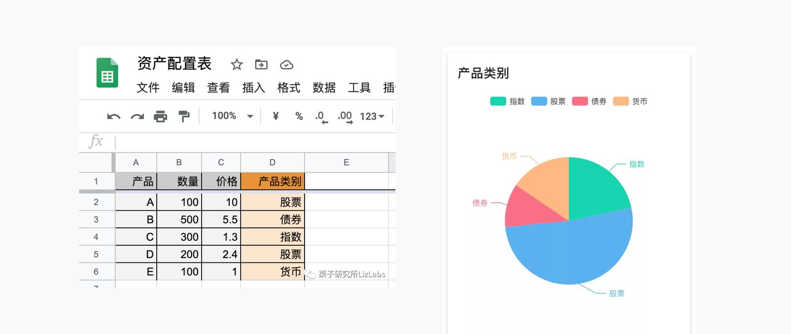
来源:[S5] 少数派文章配图「用 Excel 来盘点资产」

**定位**:「一站式资产管理」「专注于资产配置 —— 分散风险,获取长期收益」[S1 截图 1、2]。核心价值是**看清配置比例**,不是记账、也不是收益分析。
用户评论里也有人明说「收益率这些不需要,我就需要基于最原子级种类的,各个维度的统计透视(配上净值自动更新)」(2025-04-14,5★)[S4]。

**目标用户**〔推断,依据 [S5][S7][S4]〕:有一定投资、资产散在多个券商 / 基金平台、在意隐私、用 iPhone 的个人或夫妻;关心配置比例多于收益率。

**商业模式**:免费下载,一次性内购「高级会员 ¥12.00」[S1];评论里有多位「买了会员」的用户 [S4]。会员解锁什么,公开渠道〔未查到〕。
**隐私即卖点**:无需注册、数据只在手机本地和 iCloud,开发者「不会收集、上传您的个人数据」[S8];App Store 隐私标签「未收集数据」[S1]。

---

## 3 · 核心模型分析(范围层 + 结构层)

### 3.1 数据模型

| 概念 | 是什么 | 证据 |
|---|---|---|
| **资产**(最小单位) | 一条持仓:名称、持有份额、价格、币种、持有总额(= 份额 × 价格,原币)、资产大类、各标签组的标签 | [S5 图「新增资产示例」][S5 三部曲 Step2] |
| ├ **标准资产** | 来自「金融产品库」,选中后显示「名称 (代码) - 市场」,价格可自动刷新;版本说明里用的就是「标准资产」这个词 | [S5 图][S3 1.4.5「部分标准资产默认币种错误」] |
| └ **自定义资产** | 没有公开价格的(房产、车、茅台、字画),价格自己填 | [S5][S7] |
| **资产大类** | 用户自定义的一组类别,每个资产选**一个**(如 指数基金 / 主动型基金 / 个股 / 债券 / 货币) | [S5 三部曲 Step1、Step2] |
| **标签组** | 多个维度,每组一套标签:行业、地域、持有人、账号……;「账号」也只是一个标签组 | [S1 描述][S5 图「标签组示例」][S1 截图 1、2] |
| **负债** | 以负值资产的形式出现(截图里「信用卡欠款 −5,000」);2.0 起透视支持负债 | [S1 截图 1][S3 2.0.0] |
| **快照** | 手动点「创建快照」,记下当时的总额与分布;历史曲线「**仅显示历史快照中的点和当前点**」 | [S1 截图 2、4] |
| **主币种** | 全局显示币种,可切换(1.6.0) | [S3] |

**模型特点**〔推断〕:

- **以「标的」为中心、账户退化成标签**。好处是同一只基金在不同平台的持仓可以在「行业」「市场」维度合起来看;代价是没有「账户余额」这个概念,
  也就没有转账、收支、账户收益率 —— 这正好对应评论里「如果每项资产关联一个本金账户,自动计算 roi 就完美了」(2026-01-02)[S4]。
- **时间维度靠手动快照**,不是固定周期。历史曲线只在点了快照的时刻有点 [S1 截图 4]。
- **持有人只是标签**,没有多用户;家庭共用就是一台手机上的一份数据 + iCloud。

### 3.2 价格与汇率从哪来

开发者的隐私条款写明了联网的两件事 [S8]:

- 「资产的价格刷新功能。获取最新的资产价格时,**仅上传资产名称**,不上传持有份额、持有总额、资产标签。」
- 「多币种间的转换功能。获取最新汇率时,**仅上传币种**。」

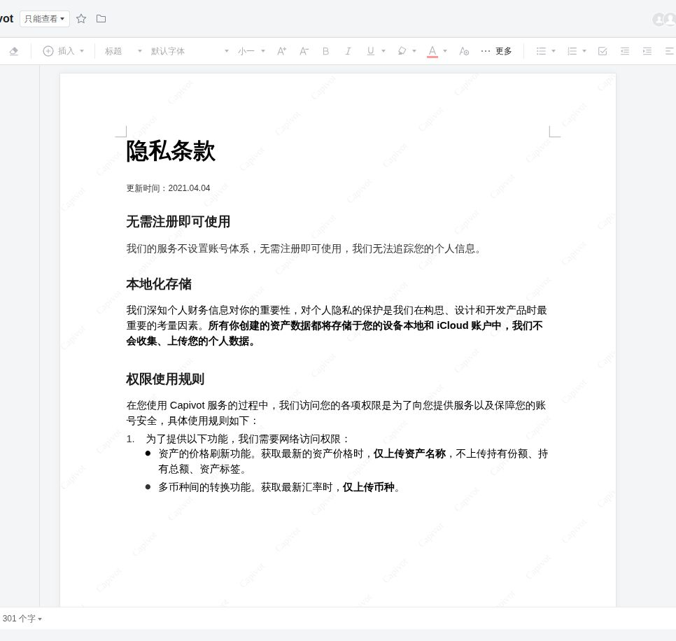
来源:[S8] Capivot 隐私条款(腾讯文档)

〔推断〕即:客户端拿标的标识去开发者的行情服务换价格,金额只在本地算。具体用哪家行情源,公开资料〔未查到〕;
2.2.0 的更新说明写了「修复数据源问题」[S3],2★ 评论说「数据经常时间无法更新和添加」(2026-09-30)[S4],
另有评论说「汇率数据失真,也不支持切换数据源」(2024-12-12)、「usd 兑 RMB 还停留在 7.1」(2023-10-18)[S4] ——
**单一数据源、不可切换,是它被反复抱怨的点**。

### 3.3 信息架构

〔推断,依据截图〕三个底部 Tab:**资产列表**(按标签组分组 / 筛选 / 排序 / 刷新)、**资产统计**(净资产、资产 / 负债、资产透视、创建快照)、
**我的**(App 描述里的「我的 - 加入群聊 / 意见与反馈」)[S1 截图 1、2、5][S1 描述]。2021 年的 1.x 版本把「搜索持仓 / 刷新价格 / 新增资产」放在资产列表顶部 [S5 首图]。

---

## 4 · 用户动线(截图 + 操作步骤)

下面按用户实际会走的顺序列。**每条注明证据来自哪个版本的官方图**:App Store 截图是 2.x 的界面(截图里的日期 2022-08)[S1];
少数派配图是 2021-05 的 1.x 界面 [S5]。没有官方截图的动线单独标出。

### F1 · 设计资产大类(首次使用)

1. 进入资产大类编辑 → 2. 增删类别(示例:指数基金 / 主动型基金 / 个股 / 债券 / 货币)→ 3. 保存。

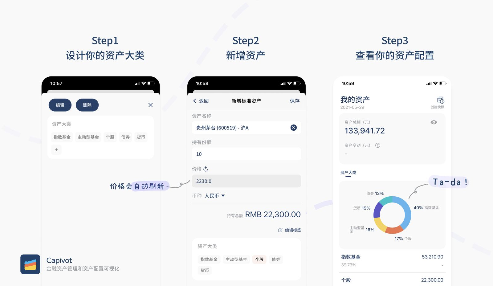
来源:[S5] 少数派配图「资产盘点三部曲」(1.x 界面,2021-05)

### F2 · 新增标准资产(**issue #25 要借鉴的核心动线**)

1. 资产列表点「新增资产」[S5 首图] → 进入「新增标准资产」
2. 在「资产名称」里选中一只(〔推断〕按名称 / 代码检索,截图只拍到选中后的状态):界面显示为「贵州茅台 (600519) - 沪A」「腾讯控股 (00700) - 港股」「苹果 (AAPL) - 美股」「**广发多因子混合 (002943) - 基金**」
3. 填「持有份额」(100 / 1000 …)
4. 「价格」自动带出,旁边有刷新图标(图上标注「价格会自动刷新」);场外基金带出的是净值(2.9326)
5. 「币种」按市场自动选(港币 / 美元 / 人民币),可改
6. 下方实时显示「持有总额」(HKD 60,150.00 = 100 × 601.5)
7. 「编辑标签」给各标签组打标;「资产大类」单选
8. 点「保存」

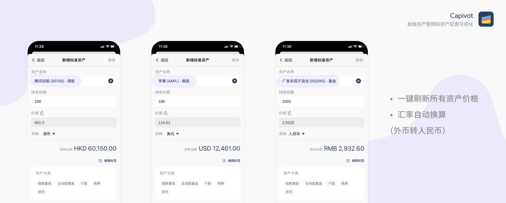
来源:[S5] 少数派配图「新增资产示例」(1.x 界面)。图右侧文字:「一键刷新所有资产价格 · 汇率自动换算(外币转人民币)」

〔推断〕整个录入**只要求用户输一个数:份额**,其余由「产品库」补全。这也是它最被夸的点:「做资产统计太方便了,可以自动拉取价格和汇率计算」(2025-06-19)[S4]。
但另一面:早期评论「有点难上手 —— 现在理财的 app 很少直接显示份额」(2021-05-31)[S4]。**只收份额,对很多用户是第一道门槛。**

### F3 · 新增自定义资产(没有公开价格的东西)

开发者文章:房产、车、茅台、字画等「没有公开价格」的资产,可以自定义价格添加 [S5][S7]。**公开渠道没有这一页的截图**。

### F4 · 资产列表:分组 / 筛选 / 排序 / 一键刷新

1. 资产列表顶部三个按钮「分组 / 筛选 / 排序」;按「账号」分组时显示「华泰证券 280,196.00」等组小计,组内是各资产与占比
2. 右上角刷新图标 = 一键刷新所有资产价格
3. 负债以负数出现在列表里(招商银行组下「信用卡欠款 −5,000.00 / −0.79%」)

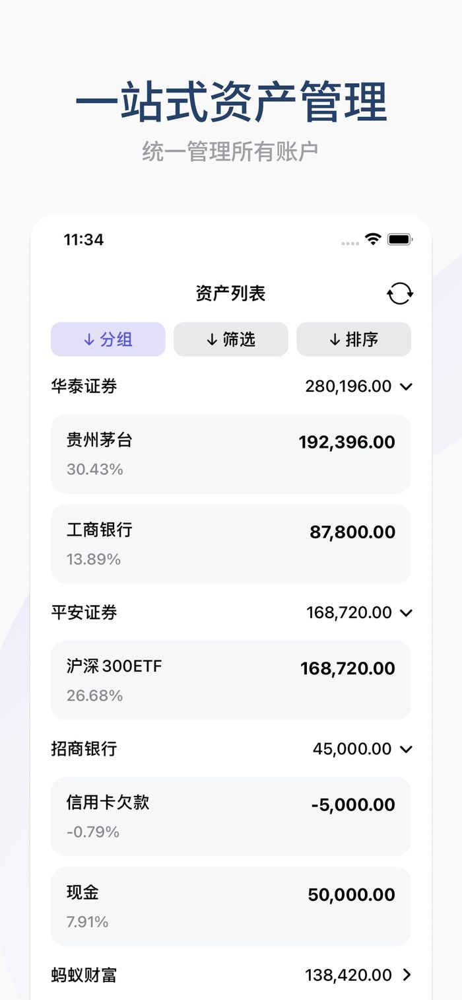
来源:[S1] App Store 截图 1「一站式资产管理 · 统一管理所有账户」(2.x 界面)

1.x 版本的同一页,顶部是「搜索持仓 / 刷新价格 / 新增资产」,每行显示代码与当日变动:

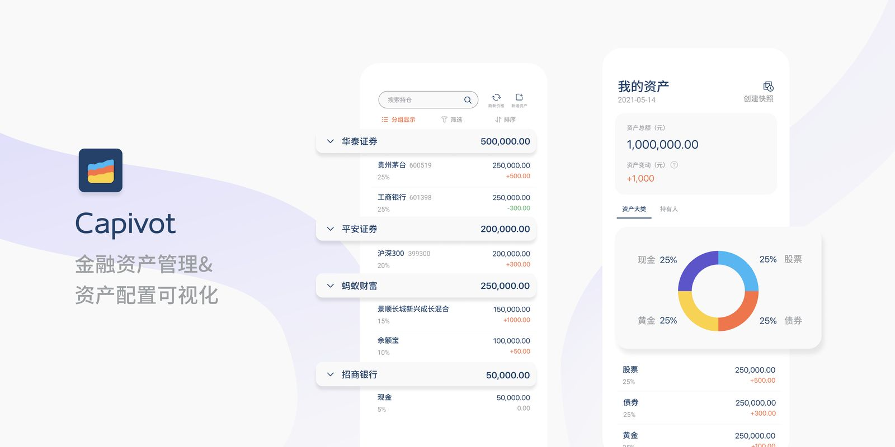
来源:[S5] 少数派首图(1.x 界面,2021-05)

### F5 · 长按改份额(快捷编辑)

1.5.0 起「在资产列表中长按某一行,可以快捷修改资产份额」[S3]。评论:「长按弹出快捷编辑功能很不错……希望这个界面也能直接备注每一笔的变动原因」(2022-11-04)[S4]。
**公开渠道没有截图**。

### F6 · 资产统计与多维透视

1. 「资产统计」顶部:净资产(¥731,840.71)+ 变动(¥99,504.71,带问号说明)+ 资产 / 负债两格;眼睛图标隐藏金额
2. 「资产透视」:切换标签组(资产类型 / 账号 / 行业 / 市场 / …),「无标签」开关,「总资产」下拉 → 环形图 + 下方列表
3. 2.1 起列表可继续下钻 [S3]

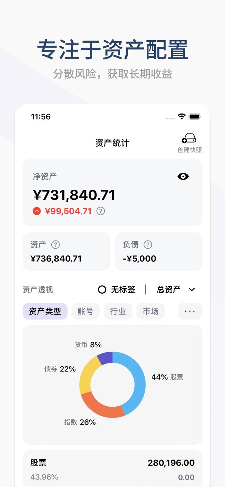 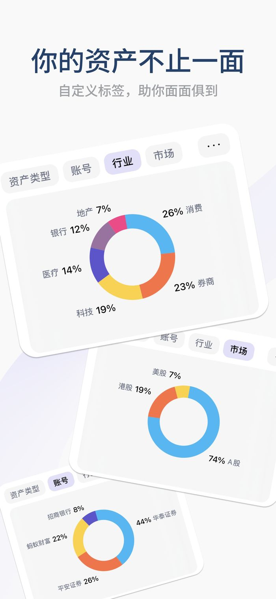
来源:[S1] App Store 截图 2「专注于资产配置」、截图 3「你的资产不止一面 · 自定义标签,助你面面俱到」

标签组的设置界面(1.x):

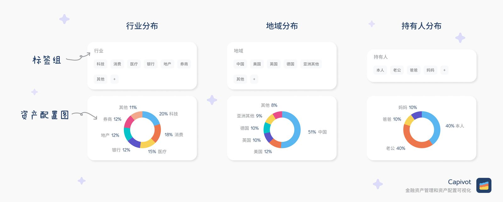
来源:[S5] 少数派配图「标签组示例」

### F7 · 创建快照 → 看历史

1. 资产统计右上角「创建快照」
2. 进入「净资产历史快照」:顶部是选中点的日期与金额,时间范围「近一周 / 近一月 / 近半年 / 近一年 / 全部」
3. 曲线下注:「**图表仅显示历史快照中的点和当前点**」—— 不点快照,就没有历史

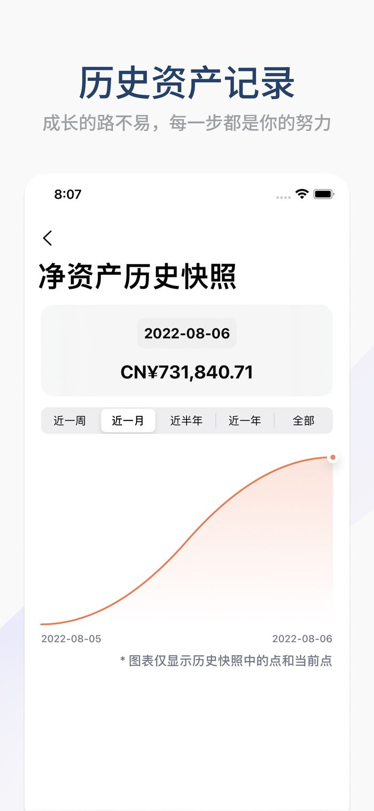
来源:[S1] App Store 截图 4「历史资产记录」

1.x 版本的「总资产历史记录」与「资产大类历史分布」:

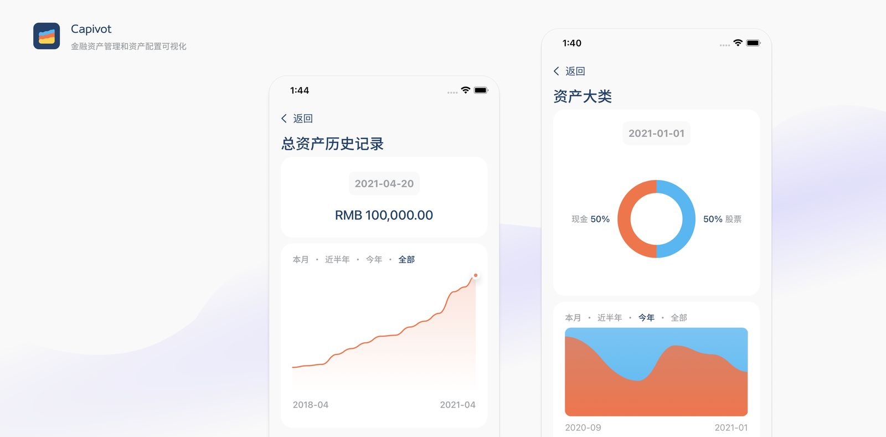
来源:[S5] 少数派配图「资产历史记录示例」

### F8 · 打开 App:Face ID 解锁

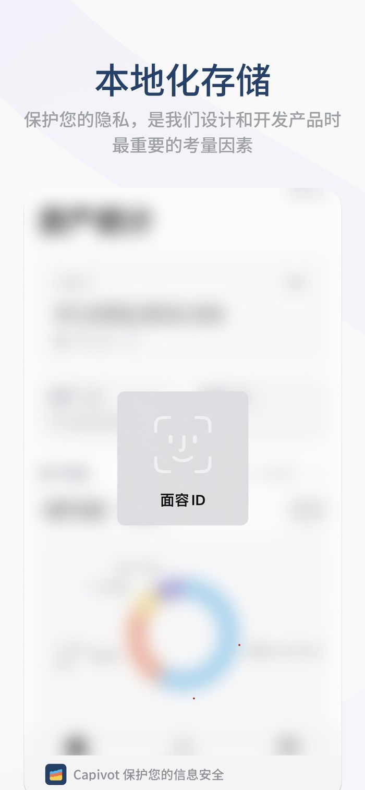
来源:[S1] App Store 截图 5「本地化存储 · 保护您的隐私」

### F9–F12 · 有文字证据、没有公开截图的动线

| 动线 | 证据 |
|---|---|
| F9 切换主币种 | 1.6.0「支持主币种切换」[S3] |
| F10 iCloud 备份 / 恢复 | 1.4.0「支持通过 iCloud 进行数据备份」[S3];隐私条款「存储于您的设备本地和 iCloud 账户中」[S8];评论「iCloud 同步时 iPhone 一直在转圈」(2024-05-07)、「在 iPad 上……没有同步我的资产过来」(2022-04-16)[S4] |
| F11 导出 Excel | 2.3.0「新增 excel 格式数据导出」(2026-10-03)[S3];同日评论「支持导出全部快照数据,好评」[S4] |
| F12 购买高级会员 | App 内购买「高级会员 ¥12.00」[S1] |

> **要补这 4 条的截图,需要在 iPhone(或 Apple 芯片 Mac)上装 Capivot 实拍。** 如果维护者愿意,用传图服务把截图发过来,我按同样的格式补进本节。

---

## 5 · 核心用户故事分析

**一手来源两类**:开发者本人讲的「为什么做」[S5][S7],以及 App Store 里 34 条带日期、带版本号的评论 [S4](全量见 [`evidence/appstore-reviews.tsv`](evidence/appstore-reviews.tsv))。
另有豆瓣小组 2022 年一个「资产太分散了」的讨论帖,作为同类需求的旁证 [S11]。

### 5.1 它满足了的故事

| # | 故事(原话) | Capivot 的对应 | 来源 |
|---|---|---|---|
| U1 | 「我目前的比例是多少?我到底有多少钱啊?」 | 资产大类 + 配置环形图 | [S5] |
| U2 | 资产分散在 20 多个账户,每次盘点很花时间;手动更新价格和汇率太累 | 标准资产库 + 一键刷新 + 汇率自动换算 | [S7][S5] |
| U3 | 了解资产配置「并不需要繁琐的明细账」 | 余额记账:只登记最新状况 | [S1][S5] |
| U4 | 想从行业、地域、持有人、账户多个角度看 | 标签组 + 透视 | [S1][S5] |
| U5 | 想看资产怎么一步步长大 | 快照 + 历史曲线 | [S1][S5] |
| U6 | 帮父母盘点(算出来比父母以为的多一百多万)| 同上 | [S5];开发者在 App Store 评论区回复「app 上架后帮父母盘点了一下,有不少惊喜」(2021-07-02)[S1] |
| U7 | 不想把财务数据交给别人 | 无注册、本地 + iCloud | [S1][S8];豆瓣帖里点赞最多的回复担心「信息安全有保障吗?细思极恐」[S11] |

### 5.2 没被满足的故事(按出现次数和时间排)

| 主题 | 原话(日期 · 星级) | 对我们意味着什么 |
|---|---|---|
| **定投 / 份额会变** | 「有一些基金是一直定投的,每次都要手动添加更新金额,说实话有点麻烦」(2026-09-02 · 4★);「基金能不能加个定投功能,每次得手动改」(2024-11-06 · 4★);「希望能增加资金定期增减功能」(2023-03-17 · 5★) | 按份额估值的天然痛点:份额一变就要人改。我们「每月核对一次」的节奏能吸收它,但 PRD 要正视 |
| **收益 / 本金** | 「如果每项资产关联一个本金账户,自动计算 roi 就完美了」(2026-01-02);「如果图表能增加收益日历和收益率就更好了」(2021-06-09) | **我们的强项**:账户级净投入、人赚 / 钱赚、XIRR |
| **数据不准 / 不更新** | 「数据经常时间无法更新和添加」(2026-09-30 · 2★);「汇率数据失真,也不支持切换数据源」(2024-12-12 · 3★);「usd 兑 RMB 还停留在 7.1」(2023-10-18) | **警惕**:净值要显示「净值日期」,拉不到要说出来,不能静默用旧值 |
| **多端同步** | 「没办法多终端同步」(2021-05-31);iPad 不同步(2022-04-16);iCloud 一直转圈(2024-05-07) | 我们是自建 Web,天然多端 |
| **拍照导入** | 「基金等数量比较多,希望能开发一个拍照一键上传的功能」(2022-06-28) | **我们 v1.4 已有 AI 截图导入** |
| **贵金属** | 「希望可以考虑加入贵金属」(2025-01-22);「可以加入黄金,白银价格的变化」(2024-04-29) | 我们 v0.14 已有 |
| **份额难找** | 「现在理财的 app 很少直接显示份额」(2021-05-31 · 4★) | PRD 要支持「按当前市值反推份额」 |
| 其他 | FOF 加不了(2021-08-29);投顾组合(2024-03-13);负债(2021-11-14,2.0 已做);Excel 导出(2024-04-29,2.3.0 已做);标签组排序(2024-05-20、2025-01-20,2.2.0 已做) | FOF 在天天基金代码表里有 1,370 只 [S14],按代码同样能估值 |

### 5.3 小结

Capivot 打动人的是**「输一个份额,价格、汇率、配置图全自动」**这一条;它被抱怨的是**「份额会变」「数据会旧」「只能在一台设备上看」「看不到收益」**。
前两条是「按代码 + 份额估值」这个模式自带的问题,我们照搬时必须一起解决;后两条恰好是我们已有的能力。

---

## 6 · 与我们产品的对比

本产品的事实来源:仓库代码与文档(`README.md`、`AGENTS.md` §3、`Market.java`、`StockHoldingService.supportsHoldings`、`EastMoneyFundClient.java`),
以及 2026-10-05 在 beta 上的截图(隐私模式开着,金额已糊)。

### 6.1 模型对比

| 维度 | Capivot | 本产品 |
|---|---|---|
| 最小单位 | 资产(标的) | **账户**;股票 / 理财 / 现金 / 加密 / 贵金属类账户下可挂持仓(`StockHoldingService.supportsHoldings`) |
| 账户 | 一个标签组「账号」 | 一等公民:余额、币种、转账、收支、账户收益率 |
| 分类 | 资产大类(单选,自定义)+ 多个标签组 | 账户类型 + 产品类目 + 持仓级的资产类型 / 行业 / 风险 / 流动性标签 + 账户分组 + 资产透视 |
| 时间 | 手动快照 | **月度账期**:填报 → 关账定格 → 报表 |
| 收益 | 无(用户在要)[S4] | 净投入、人赚 / 钱赚、XIRR、本月资产收益 |
| 多人 | 无(持有人是标签) | 家庭多成员,各自填报 |
| 存储 | 手机本地 + iCloud [S8] | 自己的服务器(Docker / systemd),浏览器多端 |
| 负债 | 负值资产 | 负债类账户 |

### 6.2 「按代码自动估值」覆盖面

| 品种 | Capivot [S1] | 本产品 | 证据 |
|---|---|---|---|
| A 股 | ✓ | ✓ | `Market.CN`;新浪(主)+ 腾讯(备) |
| 港股 / 美股 | ✓ | ✓ | `Market.HK` / `Market.US` |
| 场内基金(ETF / LOF) | ✓ | ✓(按 A 股代码) | issue #25 首条回复 [S17] |
| **场外基金** | **✓**(截图里有 002943)| **✗**:只能手填市值、截图导入;v1.5 的穿透能把名称解析成基金代码,但不拿净值估值 | `EastMoneyFundClient.resolveCode`;beta 演示数据「支付宝-余额宝」账户 13 条持仓里 12 条是「手填市值」,其中 6 条已带着穿透解析出的基金代码(下图) |
| 沪深债券 / B 股 | ✓ | 〔未验证〕—— 走 A 股通道能否拉到,没测 | — |
| 数字货币 | ✓ | ✓(Binance / CoinGecko / Coinbase) | `Market.CRYPTO` |
| 贵金属 | ✗(用户在要)[S4] | ✓(v0.14) | `Market.METAL` |
| 银行理财 | ✗ | ✗(手填 / 截图导入) | 见 §6.5 |

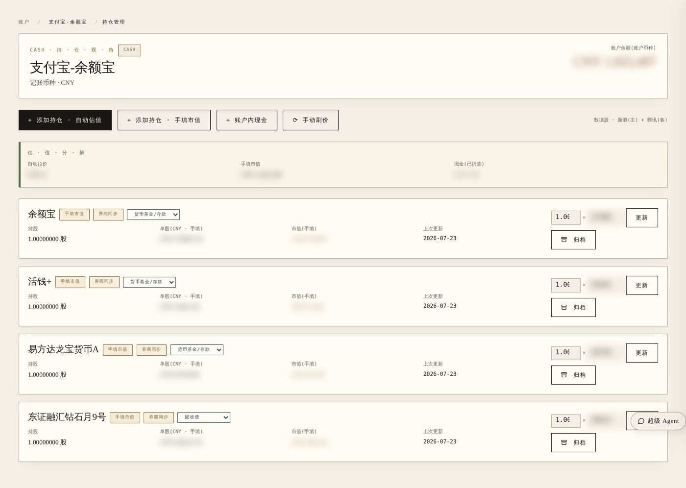
本产品 beta · 「支付宝-余额宝」账户的持仓页(演示数据,隐私模式)

### 6.3 动线对比:新增一条会自动估值的持仓

| 步骤 | Capivot(F2) | 本产品(添加持仓 · 自动估值) |
|---|---|---|
| 选市场 | 不用选,搜到即带出市场 | 先选「美股 / A 股 / 港股」单选卡 |
| 找标的 | 从产品库选中,显示「名称 (代码) - 市场」(〔推断〕可检索) | 手输代码,下方提示格式;**没有联想、看不到名称** |
| 价格 | 选中即带出,保存前可见 | 保存后「立即拉一次价」 |
| 份额 | 必填 | 必填(持股数) |
| 币种 | 按市场自动 | 按市场默认,可改 |
| 其他 | 标签、资产大类 | 显示名、买入成本、「从账户现金划转买入」 |

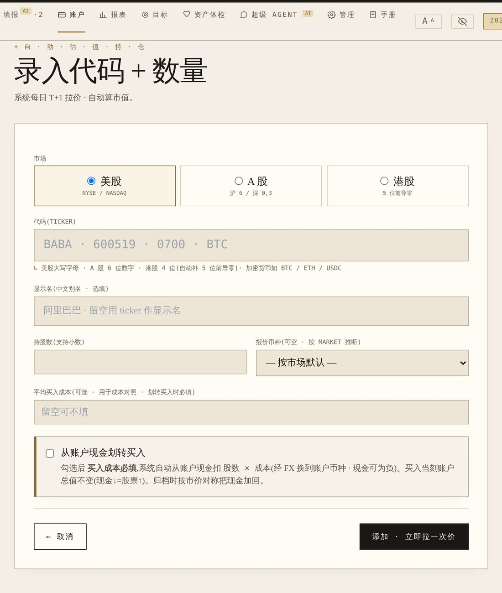
本产品 beta · `/accounts/{id}/holdings/new-auto`

〔判断〕Capivot 这一条动线好在**「先看见、再确认」**:搜到名字、看到价格和总额才保存。我们是「先填代码、保存后才知道对不对」。
场外基金代码是 6 位纯数字、和 A 股代码长得一样,**不先显示名称,用户很容易填错还不知道**,所以这次必须把「搜 → 看到名称和净值 → 再填份额」做出来。

### 6.4 人有我无 / 人有我有 / 人无我有(京东方法 [S12])

- **人有我无**:场外基金按代码估值;名称 / 代码联想搜索 + 保存前预览;长按快捷改份额;(沪深债券 / B 股 〔未验证〕)。
- **人有我有**:一键刷新价格(我们是填报页「刷新持仓估值」+ 各市场定时拉价,定时默认关)、外币自动换算 + 切换显示币种、多维透视、历史曲线、余额记账、负债、隐私(我们是自建)、导出(我们是账户账本 CSV)。
- **人无我有**:家庭多成员与月度填报;收益拆分(人赚 / 钱赚、XIRR)—— Capivot 用户在要;**AI 截图导入**(Capivot 用户 2022 年就在要「拍照一键上传」);
  券商只读同步(富途 / 老虎 / 盈透);基金穿透;贵金属;AI 体检与建议;浏览器多端。

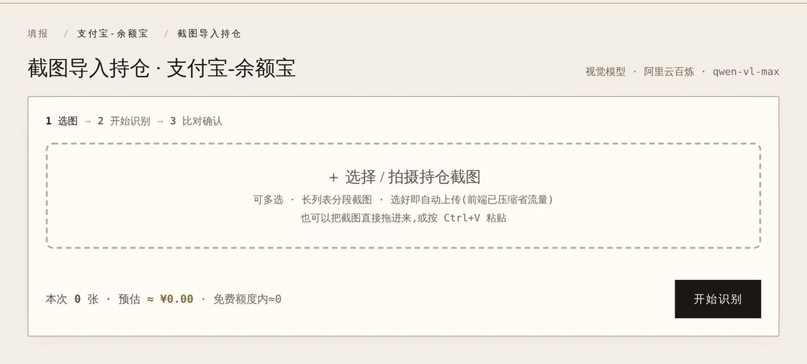
本产品 beta · `/entry/import/{accountId}`(v1.4)

### 6.5 数据可得性(决定能做多大)

- **场外基金**:天天基金 `fundcode_search.js` 实测 28,010 条「代码 / 名称 / 类型」,`pingzhongdata/{code}.js` 给每日单位净值;
  QDII 晚 1 个交易日(270042 净值日期 09-29,混合基金 002943 是 09-30);货币基金(`ishb=true`)没有净值序列,只有万份收益 / 七日年化 [S14]。
  这两个文件本产品 v1.5 起就在读(`EastMoneyFundClient.java`),**不是新数据源**。
- **银行理财**:2026-09-01「理财行业统一信息披露平台」全面上线,32 家理财公司、141 家银行接入,能按产品登记编码查份额净值与净值日期 [S15][S16];
  监管依据是 2026-09-01 施行的《银行保险机构资产管理产品信息披露管理办法》[S19]。但它的查询接口请求体加密、先做 RSA 握手 [S14],**没有可用的公开接口**。

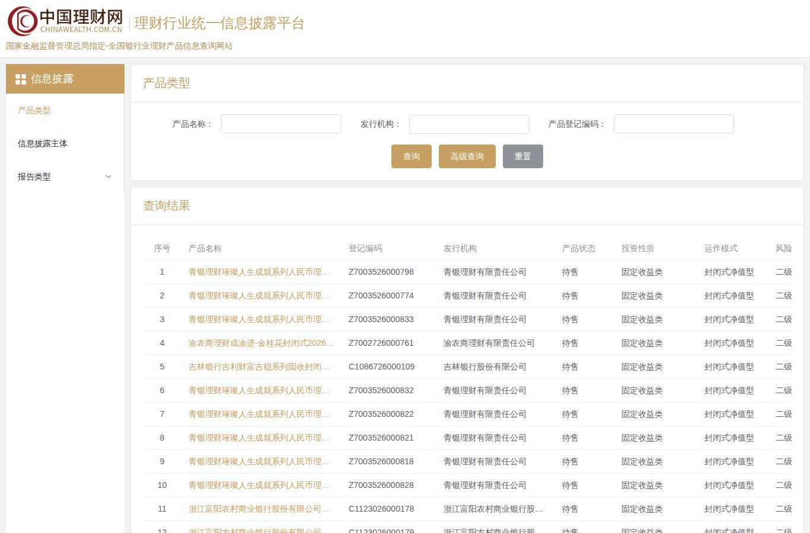
来源:[S16] 首页查询区(产品名称 / 发行机构 / 产品登记编码)与结果表(份额净值 / 净值日期)

---

## 7 · 总结与建议

### 7.1 Capivot 的 SWOT

| | |
|---|---|
| **优势** | 「输份额即估值」的标准资产库,覆盖到场外基金 [S1][S5];多维标签透视 [S1];隐私与轻量 [S8];录入前可见价格与总额 [S5] |
| **劣势** | 只在 Apple 设备上 [S1];单一数据源、出过长期不更新的汇率 [S4];没有收益 / 本金概念 [S4];快照要手动点 [S1 截图 4];曾停更约 27 个月 [S3][S9] |
| **机会**(对我们) | issue #25 的提问者就是它的用户 [S17];它的用户在要的收益、多端、拍照导入,我们已有 |
| **威胁**(对我们) | 2026-10 它恢复更新(2.2 / 2.3),并在补 Excel 导出等短板 [S3] |

### 7.2 我们该怎么做

1. **抄**:「按代码找到标的 → 看到名称与最新净值 → 只填份额」这条动线,**扩到场外基金**。
2. **改良**(针对它被骂的点):
   - 显示「**净值日期**」;拉不到 / 过期要明说,不静默用旧值(对应 [S4] 的「数据不更新」「汇率停在 7.1」)。
   - 份额不好找 → 允许「**按当前市值反推份额**」,标明是估算(对应 [S4]「很少直接显示份额」)。
   - 份额会变(定投)→ 不做定投流水(撞「刻意不做 · 逐笔流水账 / 定投提醒」),**月度填报时让改份额顺手**。
   - 已经通过 v1.4 截图导入 / v1.5 穿透拿到基金代码的手填持仓 → **一键转成自动估值**,不让用户重录。
3. **不抄**:资产为中心的模型、手动快照、只在本地 —— 这些和我们「家庭 · 月度 · 账户」的定位冲突。
4. **暂不做**:银行理财自动净值(没有可用接口);沪深债券 / B 股先另行验证。
5. **货币基金**单独处理:净值恒为 1,「份额 = 金额」,不去拉净值。

→ 落成 [`prd/v1.30.md`](../../../prd/v1.30.md)。

---

## 8 · 资料来源(访问日期均为 2026-10-05)

| 编号 | 资料 | 类型 | 时效 |
|---|---|---|---|
| S1 | App Store 中国区 · [Capivot](https://apps.apple.com/cn/app/id1558963248):描述、内购、隐私标签、5 张截图 | 一手(官方) | 当前(v2.3.0) |
| S2 | Apple iTunes Lookup 接口 · [lookup?id=1558963248&country=cn](https://itunes.apple.com/lookup?id=1558963248&country=cn) → [`evidence/itunes-lookup-cn.json`](evidence/itunes-lookup-cn.json) | 一手(官方接口) | 当前 |
| S3 | App Store 版本历史(S1 页面内嵌数据)→ [`evidence/appstore-version-history.tsv`](evidence/appstore-version-history.tsv) | 一手(官方) | 2021-10 ~ 2026-10-03 |
| S4 | App Store 用户评论(Apple 官方 RSS,中国区 + 美区)→ [`evidence/appstore-reviews.tsv`](evidence/appstore-reviews.tsv) | 一手(用户原话) | 2021-04 ~ 2026-10-03 |
| S5 | 栗子研究所LizLabs《[Capivot - 给想要好好理财的你](https://sspai.com/post/66945)》,少数派,2021-05-30(**开发者本人**)| 一手(作者) | 2021(1.x 界面) |
| S6 | 栗子研究所官网 · [Capivot](https://lizlabs.com/2023/10/04/capivot.html),2023-10-04 | 一手(官方) | 2023 |
| S7 | 小众软件论坛 · [开发者自荐帖](https://meta.appinn.net/t/topic/24037),2021-06-12 | 一手(作者) | 2021 |
| S8 | [Capivot 隐私条款](https://docs.qq.com/doc/DQnJ0VnVTWVRWdm9Z)(腾讯文档,更新时间 2021-04-04) | 一手(官方) | App Store 当前仍链接此文 |
| S9 | V2EX《[[iOS 公测招募] iAssets 资产管理管家](https://www.v2ex.com/t/1207013)》第 26 楼,2026-04-20 | 用户言论 | 2026 |
| S10 | V2EX《[有啥好用的记账软件推荐吗](https://www.v2ex.com/t/1083091)》第 22 楼,2024-10-24 | 用户言论 | 2024 |
| S11 | 豆瓣小组《[资产太分散了,有没有一个软件可以看到自己的总资产的](https://www.douban.com/group/topic/277193847/)》,2022-10-22 | 用户言论 | 2022 |
| S12 | 京东 JellyDesign(京东设计中心 JDC)《[如何用以终为始的方式做竞品分析?我总结了这 4 个方面!](https://www.uisdc.com/competitive-product-analysis-5)》,优设,2022-01-28 | 方法(大厂团队) | — |
| S13 | 张在旺《有效竞品分析》([豆瓣](https://book.douban.com/subject/34852373/));作者文章《[如何写一份靠谱的竞品分析报告?](https://www.woshipm.com/evaluating/5672064.html)》 | 方法 | 第 2 版 2024 |
| S14 | 天天基金公开文件实测 + 理财信披平台接口观察 → [`evidence/fund-data-check.md`](evidence/fund-data-check.md) | 一手(实测) | 2026-10-05 |
| S15 | 新华网《[理财行业统一信息披露平台全面上线运行](https://www.news.cn/fortune/20260903/4bf1097f5750434ca4b8a6486e89f7e7/c.html)》,2026-09-03 | 权威媒体 | 2026-09 |
| S16 | [理财行业统一信息披露平台](https://xinxipilu.chinawealth.com.cn) | 一手(官方) | 2026-10-05 实看 |
| S17 | [issue #25](https://github.com/LuoDi-Nate/financial-management/issues/25) 原文 | 一手(用户) | 2026-09-28 |
| S18 | 本仓库:`README.md`、`AGENTS.md`、`prd/v1.4.md`(截图导入)、`prd/v1.5.md`(基金穿透)及文中点名的源码 | 一手(内部) | 当前 master |
| S20 | 美区 App Store · [Percento - Net Worth Tracker](https://apps.apple.com/us/app/percento-net-worth-tracker/id1494319934) 页面的相关 App 列表(含 Capivot 链接) | 一手(官方) | 2026-10-05 实看 |
| S19 | 《银行保险机构资产管理产品信息披露管理办法》([上海市政府政策库转载](https://www.shanghai.gov.cn/gwk/search/content/4b3a03389c984797b0b193a258a6c23d)),2026-09-01 施行 | 法规 | 现行 |

**图片版权**:`img/cv-*` 来自 Capivot 开发者的公开宣传材料(App Store / 少数派 / 官网)与其隐私条款页面,仅为竞品研究引用,版权归原作者;
`img/ext-*` 为公开网站页面截图;`img/ours-*` 为本产品 beta 截图(演示数据)。
