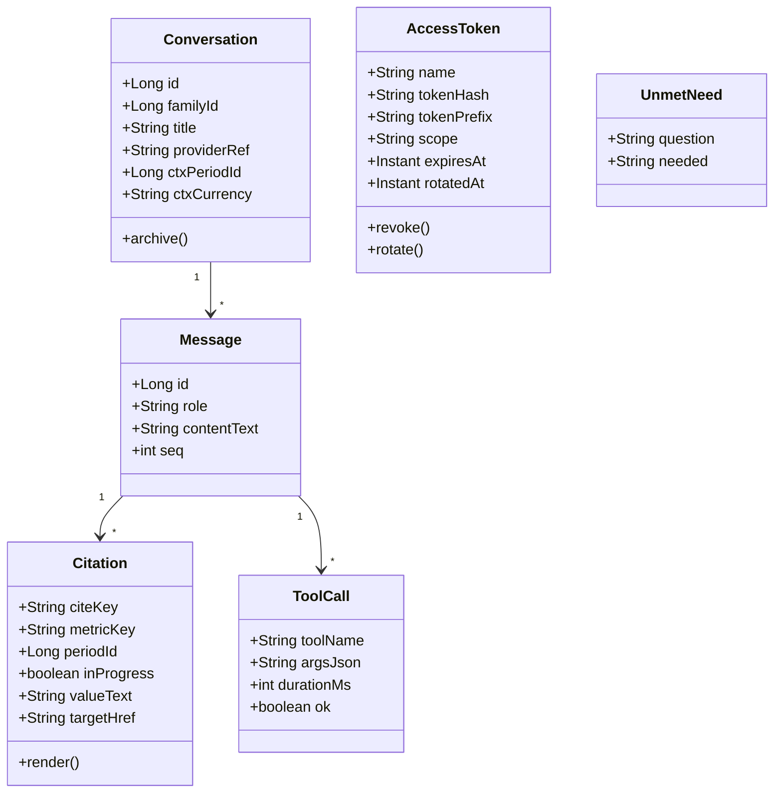
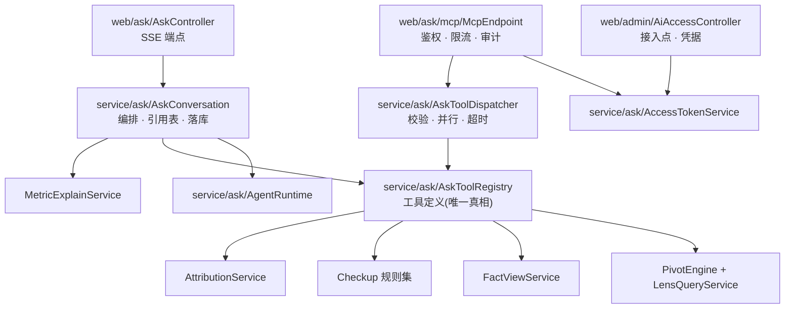
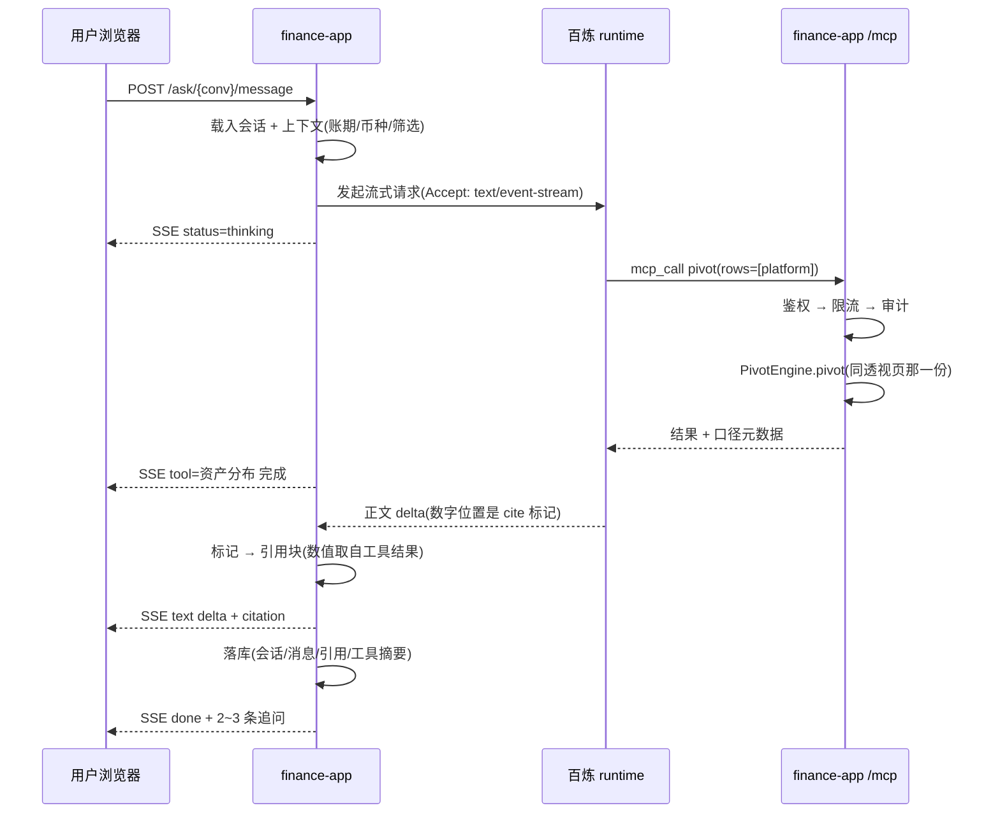
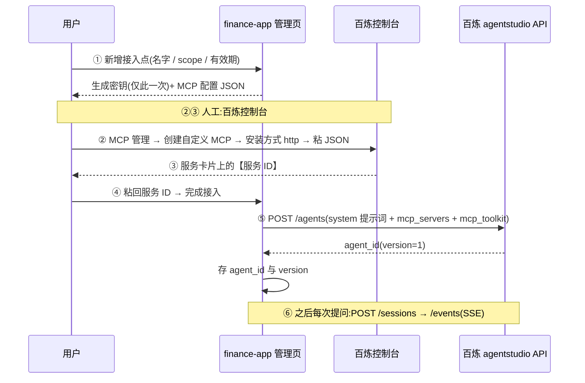
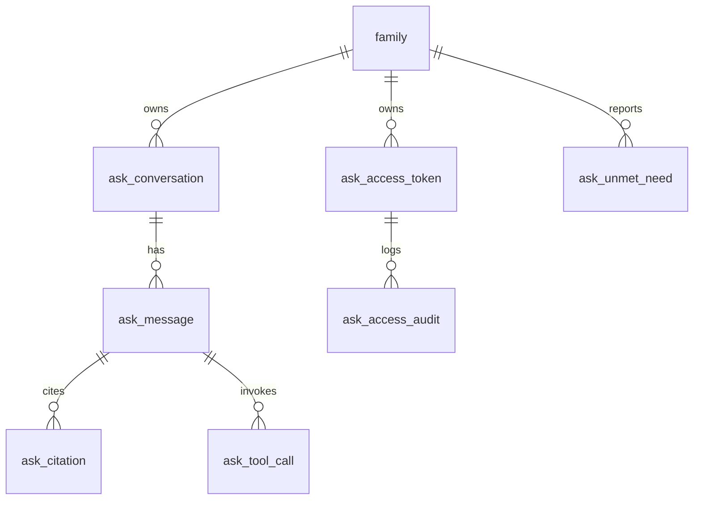
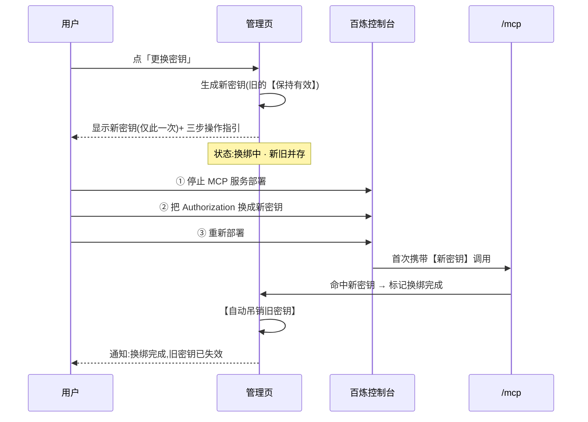
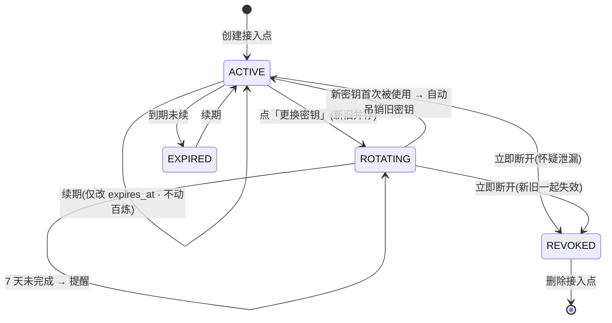

# v1.19 · 超级 Agent(资产对话)· 技术方案设计

---

## 零、前置检查

| 检查项 | 状态 |
|---|---|
| **需求(PRD)** | [x] [`prd/v1.19.md`](../prd/v1.19.md) 与 [`preview/v1.19/ask.html`](../preview/v1.19/ask.html) 已交付,**等第一道 gate 通过** |
| **上游依赖 · 阿里云百炼** | [x] 接口能力已查证(见下表)· [ ] **两项待实测**,未实测前不进入编码 |
| **上游依赖 · 用户环境** | [ ] 需用户实例**公网可达 + HTTPS**;不满足则本功能不可用(PRD FR-434b) |
| **凭据** | [x] 复用「数据源接入」页已有的通义 API Key,**不新增出站凭据** |

### 依赖方接口能力核对(已查证)

| 能力 | 结论 | 影响 |
|---|---|---|
| Managed Agents 创建 Agent | `POST /api/v1/agentstudio/agents`,字段 `name` / `model` / `system` / `tools` / `mcp_servers` / `skills` / `metadata` | 可编程创建 |
| Managed Agents 挂 MCP | `mcp_servers: [{type, name}]` —— **只能引用已注册服务**,不含 url / headers | **无法内联**,见附录选型二 |
| 注册自定义 MCP 服务 | **无公开 API**(控制台 / AI 网关 / 函数计算三条路均需人工) | MA 路线**做不到一键接入** |
| Responses API 挂 MCP | `tools: [{type:"mcp", server_url, headers:{...}}]` —— **可内联,含鉴权头** | 可一键接入 |
| Agent 更新语义 | **全量替换 + 乐观锁**(带 `version`),缺省字段视为清空 | 更新时必须带全字段 |
| Session / 事件流 | `POST /sessions` · `POST /sessions/{id}/events`(`Accept: text/event-stream`) | 流式可用 |
| MCP 鉴权 | 规范**禁止**在 URI query 传 bearer token;百炼**不支持** OAuth 交互式授权(401 → 发现 → DCR) | 只能静态 Bearer 走 Header |

### 待实测(阻塞编码)

| # | 待测项 | 不通过怎么办 |
|---|---|---|
| **T1(致命)** | 百炼控制台注册自定义 MCP 时,**能否配置 `Authorization` 头** | **不能 → 整个功能不做**。绝不退化成 token 放 URL —— 违反 MCP 规范且必进日志 |
| **T2(影响轮换体验)** | 修改已部署 MCP 服务的配置,是否真的必须「停止部署 → 改 → 重新部署」 | 若可直接编辑 → 换绑向导第 2 步简化;若确需重部署 → 向导按 §四.3.5 的三步走,并如实告知会短暂中断 |
| **T3(影响成本)** | Managed Agents 的**沙箱 / 会话容器是否单独计费** | 公开文档查不到明确条款,而百炼在别处有先例(知识问答 = 规格费用 + 模型费用)。**若按时长另计,§六 的测算要重做**,且可能反转选型 |

---

## 一、需求分析

### 1. 背景 & 目标

**PRD**:[`prd/v1.19.md`](../prd/v1.19.md) · **Preview**:[`preview/v1.19/ask.html`](../preview/v1.19/ask.html)

现状:产品里已有六处 AI(体检诊断 / 调仓建议 / 月报叙事 / 透视洞察 / 归因复盘 / 目标解读),
形状完全相同 —— **我们挑好事实 → 填进固定 prompt → 渲染成固定卡片**。
好处是数字可控;代价是**用户不能问自己的问题**。

目标:让用户**自己问**。我们维护系统提示词与工具清单,由 agent 自己决定调什么、调几次、什么顺序。

**这一版真正变化的是「谁在决定取哪些数」** —— 全部技术取舍都由此而来。

### 2. 需求理解(验收口径)

| # | 场景 | 期望 |
|---|---|---|
| S1 | 非技术用户**不打字**,只点预置问题 | 能完成一轮有价值的问答 |
| S2 | 答案里出现金额 / 百分比 | **每一个**都能点回产生它的页面,账期标注与该页**逐字一致** |
| S3 | 问「该不该提前还贷」(结论会被未知条件翻转) | agent **先追问**,不直接下结论 |
| S4 | agent 试图获取原始表或执行写操作 | **拿不到** —— 工具层物理不提供 |
| S5 | 用户改视图币种 / 账户筛选 / 观察账期 | 对话上下文跟随并**显式回显** |
| S6 | 未配通义 key,或实例不可公网访问 | 页面**逐条说清是哪一项不满足** + 给下一步 |
| S7 | 凭据泄露 | 一键吊销;异常调用自动熔断并通知 |

---

## 二、系统概要设计

### 1. 整体设计思路

#### 需求影响面

| 影响 | 说明 |
|---|---|
| **新增** | 只读工具层 · MCP 端点 · 对话编排与存储 · 管理页「AI 接入」· 前端对话壳(侧栏 / 全屏页) |
| **改动** | `LensQueryService` 组装 `Position` 时多填一个 `custody` 标签(透视页顺带多一个维度) |
| **不动** | 事实层 / 指标层 / 体检规则 / 归因引擎 —— **一行计算都不新写** |

#### 三条核心原则(后面所有细节都服从它们)

**① 自由度来自复用语义层,不来自开放原始数据。**

项目已有 `LensQuery(rows, cols, measures, filters)` + `PivotEngine` —— 这就是资产透视页背后的语义层。
开放它即得到 **11 维 × 6 度量 × 任意筛选 × 行列交叉** 的组合空间,
而**聚合权仍在我们手里**:agent 说「按平台分组」,是 `PivotEngine` 去分组,
它拿到的已经是分好组、算好占比、带小计的结果 —— **没有算术可做**。

> 项目有一条用生产事故换来的铁律:**LLM 禁止做任何四则运算,数字必须原样照抄**。
> 在这个设计下它不再是限制,而是**不必要**。

**② 数字保真是结构性的,不是约定性的。**

模型正文里**不写数字**,写引用标记 `{{cite:c1}}`;渲染时替换成引用块,数值直接取自工具结果。
模型**没有机会**打错数字 —— 它手里根本没有数字字符串,只有 id。

**③ 只读与边界是物理的,不是 prompt 约束的。**

工具层不提供任何写入口、不提供 SQL、不提供原始表。prompt 注入也改不了数据。

### 2. 领域模型设计



| 对象 | 关键行为 | 约束 |
|---|---|---|
| `Citation` | `render()` 在**渲染期**生成口径文案 | 与页面共用 `MetricExplainService`;页面改口径,历史对话跟着改 |
| `AccessToken` | `rotate()` | 旧凭据进入 **24 小时 grace**,期间可用但标 `USING_ROTATED` |
| `AccessToken` | `revoke()` | **立即**失效,跳过 grace |
| `Conversation` | 上下文变更 | **不新建会话**,只插一条分隔提示 |
| `ToolCall` | 落库 | **只存摘要,不存返回体** |

### 3. 代码架构设计



| 层 | 职责 | **不许做** |
|---|---|---|
| `web/ask/**` | 协议、鉴权、限流、审计 | 任何业务计算 |
| `AskToolRegistry` | **工具定义唯一真相** —— OpenAPI 规格与 MCP tools 都由它生成 | 各写一套 |
| `service/ask/tools` | 参数校验 → 调既有 service → 包口径元数据 | **一行计算都不写** |
| `AskConversation` | 编排、引用表、落库 | 知道供应商是谁 |
| `*Runtime` | 唯一允许出现百炼 / `dashscope` 字样的地方 | 触碰业务对象 |

> **`AgentRuntime` 抽象的取舍**:设计时它只有一个实现,是**投机性**的抽象,
> 保留的理由是「百炼 Assistant API 三个月前还是官方推荐、现在已下线中,这一领域的接口寿命
> 短于本项目的版本节奏」。
>
> **落地时它变成了必需的**:托管路线要求实例公网可达 + HTTPS,而多数自托管部署没有 ——
> 于是有了第二个实现 `LocalToolLoopRuntime`(模型出网、工具在本进程跑、零入网需求)。
> 两个实现对上层完全等价,`AskConversationService` 一个字都不知道供应商是谁。
> 详见附录·选型二。

### 4. 运行架构

#### 时序一:一次提问



#### 时序二:凭据校验与熔断

```mermaid
sequenceDiagram
    participant B as 百炼(无固定出口 IP)
    participant M as /mcp
    participant T as AccessTokenService
    participant N as NotificationChannel
    B->>M: Authorization Bearer fmk_xxx
    M->>T: verify(token)
    T->>T: 按 prefix 命中候选行(唯一索引)
    T->>T: argon2 verify
    alt 不匹配 / 已吊销 / 已过期
        T-->>M: INVALID 或 EXPIRED
        M-->>B: 404(不是 401)
        M->>T: 失败计数++,超阈值则临时封禁来源 IP
    else 有效
        T->>T: scope 检查 → 限流检查
        T-->>M: OK
        M-->>B: 结果
        T->>T: 异步节流更新 last_used_at
        opt 首次使用 / 调用突增 / 大量探测
            T->>N: 通知;异常时自动停用该凭据
        end
    end
```


#### 时序三:首次接入(6 步,其中 3 步人工)



**用户真正动手的是 ②③④** —— 两次复制粘贴 + 一次进控制台。
成因是 `mcp_servers` 只能引用**已注册**服务,而注册**无公开 API** ——
这是依赖方的结构限制,不是可优化项。⑤⑥ 全自动。

> **模板变更时**:`PUT /agents/{id}` 是**全量替换 + 乐观锁**,缺省字段视为清空 ——
> 更新必须带全 `name`/`model`/`system`/`tools`/`mcp_servers`,漏一个就把它清了。
> 且会话**创建时锁定 version**,已有会话不受影响。


### 5. 物理架构

#### 部署方案

本项目是**自托管单家庭应用**,两种形态,本功能对两者要求一致:

| 形态 | 构成 |
|---|---|
| **Docker Compose**(主推) | 两个容器:`app`(GHCR 镜像)+ `db`(MySQL 8.0) |
| **systemd 直装** | `/opt/finance/app.jar` + 本机 MySQL + nginx 反代(prod 现状) |

**本功能新增的部署要求**:实例必须**公网可达 + HTTPS**(百炼需回调 `/mcp`)。
不满足则功能不可用,按 PRD FR-434b 在页面上逐条说明原因。

#### 环境依赖

| 依赖 | 现状 | 本功能新增 |
|---|---|---|
| MySQL 8.0 | 已有 | 新增 7 张表 |
| Redis | **没有** | **不引入** —— 限流与失败计数用**进程内**结构(单实例部署,够用) |
| 消息队列 | **没有** | **不引入** |
| nginx | 已有(systemd 形态) | 加 `/mcp` 反代 + **`Authorization` 头不落日志** |
| 出网 | 已有(通义 / 股价 / 汇率) | 新增百炼 agentstudio 域名 |
| **入网** | **无** | **新增唯一入站面 `/mcp`** ← 全部安全设计的对象 |

#### 跨机房 / 多地域

**不适用。** 单实例自托管,无多活、无跨地域复制。
唯一地域相关点:百炼 agentstudio 端点带地域(`cn-beijing`),写成**可配置项**,不硬编码。

### 6. 数据架构设计

#### ER 模型



#### 表结构

**`ask_conversation`** —— 一段对话

| 字段 | 类型 | 非空 | 主键 | 索引 | 注释 |
|---|---|---|---|---|---|
| id | bigint(20) | YES | PK | | |
| family_id | bigint(20) | YES | | idx_fam_created | |
| title | varchar(64) | YES | | | 取首条提问前 20 字 |
| provider_ref | varchar(128) | NO | | | 云端 session / response id |
| ctx_period_id | bigint(20) | NO | | | 上下文账期 |
| ctx_currency | varchar(8) | NO | | | 上下文币种 |
| created_at | datetime(3) | YES | | idx_fam_created | |
| archived_at | datetime(3) | NO | | | 软删 |

**`ask_message`**

| 字段 | 类型 | 非空 | 主键 | 索引 | 注释 |
|---|---|---|---|---|---|
| id | bigint(20) | YES | PK | | |
| conversation_id | bigint(20) | YES | | idx_conv_seq | |
| role | varchar(16) | YES | | | user / assistant |
| content_text | mediumtext | YES | | | **含 cite 标记,不含渲染后的数字** |
| seq | int(11) | YES | | idx_conv_seq | |
| created_at | datetime(3) | YES | | | |

**`ask_citation`** —— 引用块(**本设计的关键表**)

| 字段 | 类型 | 非空 | 主键 | 索引 | 注释 |
|---|---|---|---|---|---|
| id | bigint(20) | YES | PK | | |
| message_id | bigint(20) | YES | | idx_msg | |
| cite_key | varchar(16) | YES | | | 与正文标记对应 |
| metric_key | varchar(64) | YES | | | 口径标识,渲染期据此取文案 |
| period_id | bigint(20) | NO | | | 该数字属于哪一期 |
| in_progress | tinyint(1) | YES | | | 该期是否进行中 |
| value_text | varchar(32) | YES | | | 工具返回的原值(已格式化) |
| currency | varchar(8) | NO | | | |
| target_href | varchar(255) | NO | | | 点回哪一页 |

> **为什么引用块单独建表,而不是把渲染好的 Markdown 存进 `content_text`**:
> 存 Markdown 等于把口径**冻结成一段文字**。页面口径改了(本项目一年改过三次),
> 历史对话里的说法就和现在的页面对不上,**而且没人会发现**。
> 结构化存之后,口径文案在**渲染期**生成,与页面共用一份。

**`ask_tool_call`**

| 字段 | 类型 | 非空 | 主键 | 索引 | 注释 |
|---|---|---|---|---|---|
| id | bigint(20) | YES | PK | | |
| message_id | bigint(20) | YES | | idx_msg | |
| tool_name | varchar(64) | YES | | | |
| args_json | varchar(1024) | NO | | | |
| duration_ms | int(11) | YES | | | |
| ok | tinyint(1) | YES | | | |

> **只存摘要,不存返回体** —— 返回体就是家底数据,存两份没有意义,只增加泄漏面。

**`ask_access_token`** —— 接入凭据

| 字段 | 类型 | 非空 | 主键 | 索引 | 注释 |
|---|---|---|---|---|---|
| id | bigint(20) | YES | PK | | |
| family_id | bigint(20) | YES | | idx_fam | |
| name | varchar(64) | YES | | | 如「百炼-家庭助手」 |
| token_hash | varchar(255) | YES | | | **argon2id**;明文不存 |
| token_prefix | varchar(16) | YES | | **uk_prefix** | `fmk_` + 8 位 |
| scope | varchar(16) | YES | | | `aggregate`(默认) / `detail` |
| expires_at | datetime(3) | YES | | idx_expires | |
| rotated_at | datetime(3) | NO | | | 非空 = 处于 24h grace |
| revoked_at | datetime(3) | NO | | | |
| last_used_at | datetime(3) | NO | | | 异步节流更新 |
| created_at | datetime(3) | YES | | | |

**索引说明**:`uk_prefix` 让校验时**先按前缀命中唯一候选行再做 argon2**。
argon2 故意很慢,若全表逐行验证,这个端点自身就成了 DoS 入口。

**`ask_access_audit`** —— 调用审计

| 字段 | 类型 | 非空 | 主键 | 索引 | 注释 |
|---|---|---|---|---|---|
| id | bigint(20) | YES | PK | | |
| token_prefix | varchar(16) | YES | | idx_prefix_time | **不存 token 本身** |
| tool_name | varchar(64) | NO | | | |
| result | varchar(16) | YES | | | OK / INVALID / **EXPIRED** / REVOKED / SCOPE / RATE |
| src_ip | varchar(64) | NO | | | |
| user_agent | varchar(128) | NO | | | |
| duration_ms | int(11) | NO | | | |
| created_at | datetime(3) | YES | | idx_prefix_time | |

> `EXPIRED` 与 `INVALID` **必须分开记**:对外都返 404,但用户要能看懂是「过期了」还是「填错了」。
> **不记返回体,不记请求参数里的金额。**

**`ask_unmet_need`** —— agent 够不着时的反馈

| 字段 | 类型 | 非空 | 主键 | 注释 |
|---|---|---|---|---|
| id | bigint(20) | YES | PK | |
| family_id | bigint(20) | YES | | |
| question | varchar(512) | YES | | 用户原问题 |
| needed | varchar(512) | NO | | agent 说它需要什么能力 |
| created_at | datetime(3) | YES | | |

#### 分库分表

**不适用。** 单家庭数据量:对话按每月十余轮估算,三年不足万行。

#### 刷数方案

**不涉及刷数。** 全部为新增表,无存量数据变更、无历史回填。
`custody` 维度是**运行期派生**(由 `AccountType` + `valuation_mode` + 穿透结果推导),**不落库、不回填**。

---

## 三、接口协议设计

### 1. 影响评估

| 检查点 | 结论 |
|---|---|
| 是否新增**对外**接口 | **是** —— 本项目**第一次**对外暴露 API(此前只有页面 + 一个 CSV 导出) |
| 鉴权 | 静态 Bearer 走 **Header**;规范禁止放 URI query |
| 权限粒度 | `scope`:`aggregate`(默认,只给聚合与占比)/ `detail`(含账户名与流水) |
| 错误码 | 见 §三.2;**未授权一律 404**,不用 401 |
| 限流与超时 | 60 次/分 · 2000 次/天;单次工具执行超时 10s |
| 向后兼容 | 全新接口,无存量调用方;`/api/v1/` 前缀预留版本位 |
| 最小化原则 | `aggregate` 下不返回账户名、不返回流水 |

### 2. 对外接口(只读)

规格由 **springdoc 从代码生成**(`openapi.json`),不手写,避免文档与实现漂移。

| 方法 | 路径 | 说明 | scope |
|---|---|---|---|
| GET | `/api/v1/ask/capabilities` | 自省:维度 / 度量 / 各维取值 / 可用账期 / 账户列表 | aggregate |
| POST | `/api/v1/ask/pivot` | **主力查询** | aggregate |
| GET | `/api/v1/ask/period/{p}/summary` | 一期全貌:净资产 / 总资产负债 / 人赚·钱赚·开账基线 / 紧急储备 | aggregate |
| GET | `/api/v1/ask/period/{p}/accounts` | 账户级收益表:XIRR / 累计损益 / 最大回撤 / 预实 | **detail** |
| GET | `/api/v1/ask/period/{p}/attribution` | 归因瀑布 + 贡献榜 | aggregate |
| GET | `/api/v1/ask/checkup` | 体检:规则命中 + 4 维诊断 + 再平衡偏离 | aggregate |
| GET | `/api/v1/ask/goals` | 目标进度 + 财富水位 | aggregate |
| GET | `/api/v1/ask/metric/{key}/explain` | **这个指标怎么算的**(与页面 tooltip 同一份文案) | aggregate |
| GET | `/api/v1/ask/entity?q=` | 名字 → id,返回候选 + 置信度 | **detail** |
| GET | `/api/v1/ask/account/{id}/ledger` | 某账户某期流水明细(带来源标签) | **detail** |
| POST | `/api/v1/ask/unmet` | agent 报告「我够不着」 | aggregate |

**全部只读。没有任何写接口** —— 物理保证,不是配置项。

#### `POST /api/v1/ask/pivot`

```jsonc
// 请求
{
  "rows":     ["platform"],
  "cols":     ["risk"],
  "measures": ["value", "share"],
  "filters":  { "owner": ["成员A"] },
  "period":   "2026-08",
  "currency": "CNY"
}
```

**维度白名单(11)**:`type` · `risk` · `liquidity` · `currency` · `owner` · `assetClass`(穿透后)·
`platform` · `industry`(穿透后)· `region` · `purpose` · **`custody`**(本版新增派生维度)

**度量白名单(6)**:`value` · `share` · `latestPnl` · `cumPnl` · `netPrincipal` · `openValue`

```jsonc
// 响应:直接透传 PivotEngine.Result,附口径元数据
{
  "rowDims": ["platform"], "colDims": ["risk"], "measures": ["value","share"],
  "rowKeys": [["支付宝"], ["华泰证券"]],
  "cells":   [{ "row": ["支付宝"], "col": ["低"], "values": [] }],
  "rowTotals": [], "colTotals": [], "grand": [],
  "holdingLevelSplit": false,
  "meta": { "periodId": 162, "periodLabel": "2026-08", "inProgress": true,
            "metricKey": "lens.pivot", "currency": "CNY" }
}
```

> `holdingLevelSplit` **必须原样交给 agent** —— 它标记「本次结果含持仓级维度、收益按持有口径、
> **不可归因**」。漏传会让 agent 拿一个不可归因的数去下结论。

#### 错误码

| 状态 | 场景 | 响应体 |
|---|---|---|
| **404** | 功能未启用 / 凭据无效、过期、已吊销 | 空 —— **不透露任何信息** |
| 403 | 凭据有效但 scope 不足 | `{"error":"scope_required","need":"detail"}` |
| **422** | 参数非法(维度不存在、取值不认识) | `{"error":"...","allowed":{"rows":[]}}` —— **把可用取值回给模型让它改** |
| 429 | 超限流 | `{"error":"rate_limited","retryAfter":30}` |
| 504 | 单个工具超时 | 该项标失败,其余照常返回 |

> 422 把「你可以用的取值是这些」回给模型,是**自由度设计的一部分** —— 允许试错好过直接失败。

### 3. MCP 端点

`POST /mcp`(Streamable HTTP)。工具定义**由 `AskToolRegistry` 生成**,与 OpenAPI 同源:

`pivot` · `capabilities` · `period_summary` · `account_performance` · `attribution` ·
`checkup` · `goals` · `explain_metric` · `find_entity` · `account_ledger` · `report_unmet`

### 4. 我们调用的上游接口

| 时机 | 接口 | 路线 |
|---|---|---|
| 接入完成(一次) | `POST {ws}.cn-beijing.maas.aliyuncs.com/api/v1/agentstudio/agents` | MA |
| 模板变更 | `PUT .../agents/{id}`(**全量替换 + 乐观锁**,必须带全字段) | MA |
| 每段新对话 | `POST .../sessions` | MA |
| 每轮提问 | `POST .../sessions/{id}/events`(`Accept: text/event-stream`) | MA |
| 每轮提问 | `POST dashscope.aliyuncs.com/compatible-mode/v1/responses`(`stream:true`) | Responses |

**出站凭据**:复用「数据源接入」页里通义那把 API Key,**不新增**。

---

## 四、稳定性与质量保障

### 0. 联调实测改掉的四处设计

设计阶段想不到、跑起来才暴露的。列在这里是因为每一条都改了对外行为,不是实现细节。

| 现象(实测) | 根因 | 改法 |
|---|---|---|
| 回答里说「支付宝**将近一半**、富途**约一成**」,精确数字一个没引 | `pivot` 只把**合计**登记成可引用项,行级数字模型无处可引,只能自己念约数 | 行级也发引用(`ROW_CITES=12`,单层行维时给)。约数是这个功能要消灭的东西,不能靠提示词劝 |
| 存下来的答案开头是「我来查一下平台分布。我来查一下资产情况。」 | 每轮调工具前模型都会说一句旁白,而旁白和答案走同一条 `textDelta` | 加 `AskSink.rollback`:一轮结束发现它调了工具 → 撤回那段文字,界面降级成灰字、**库里不留** |
| 模型在回答里写「pivot 返回的 period 是空的,让我确认一下」,白花一轮 | `PivotTool` 的口径元数据里 `periodId`/`periodLabel` 传了 `null` | `LensQueryService` 把「这批头寸取自哪一期」和头寸放进同一个缓存项,pivot 据此填全 |
| 引用卡上显示 `lens.pivot.value` 这种技术串 | 引用表只存 `metric_key`,而 label 常常是**数据派生**的(「支付宝 · 总资产」里的行名来自用户账户),推不出来 | `ask_citation` 加 `label` 列;口径说明按最长前缀回退(`lens.pivot.value` → `lens.pivot`) |

> 前两条有一个共同形状:**把「模型该怎么做」写进提示词是不够的,得让它有正当的动作可做。**
> 没有行级引用它就只能念约数;没有 rollback 通道旁白就只能留在正文里。

### 0.5 对话页改版 —— 对齐三家已经收敛的结构规范

第一版做完之后维护者的评价是「对话页面太丑了」。查了 Claude / ChatGPT / Manus 的现状,
发现这三家已经收敛成一套相当固定的规范,而第一版几乎每条都踩反了。

| 规范(三家共识) | 第一版 | 改后 |
|---|---|---|
| **不用气泡**,扁平 + 轻底色区分 | 用户消息是黑色实心圆角气泡 | 右对齐 + 铜色细下划线 |
| 消息流 768px · 65–72 字符 | 860px · 13.5px(一行 60 个汉字) | 768px · 15px(一行约 40 字) |
| 流式必须有光标 | 无 | 小方块闪烁 |
| **停止是 table stakes** | 无 | 协作式停止(见 §四.0.6) |
| 执行过程可折叠、默认收起 | 常驻平铺 | `<details>` 折叠成「查了 N 项」 |
| 完成后露出复制 / 重来 / 追问 | 无 | 三样齐全(追问即 FR-424b) |
| 空态「输入优先」 | 左对齐清单 | 一句话 + 可点问题 + 最近 6 条 |
| `aria-live="polite"` | 无 | 有 |

**视觉语言不动。** 照搬 Claude/ChatGPT 的中性灰白无衬线,会让这一页和全站另外十几个页面
割裂 —— 点进来像换了个应用。所以纸色底、铜色强调、eyebrow 字距全部保留,
**照搬的只是结构**。这是维护者在两个方案里选定的那条。

#### 0.6 停止为什么是协作式的

`AskSink.cancelled()` 由 runtime **在读流循环里逐行**问 —— 不是在外层轮次之间问。
差别是用户体感:放外层的话他得等这一整轮流完,而那正是他想跳过的东西。

**不强杀线程**:强杀会让落库跑不完,半截答案真的丢掉。而半截答案往往已经够用,
用户接下来多半点「继续」或「重来」。

停止位按会话 id 存 `AtomicBoolean` 而不是一个 Set —— 这样停止端点**认得出自己停的是哪一轮**;
用 Set 的话,「上一轮刚结束、新一轮刚开始」那个窗口里的停止请求会把新一轮误杀。

顺带白捡一条:`textDelta` 送不出去(用户关了页面)时也置停止位。
没人看的回答不必继续问上游要 token —— 那是真金白银。

### 0.7 改名与展示形态(2026-08-28 · 维护者第二轮)

维护者定名 **超级 Agent**(原「问一问」),并提出四点:思考过程要给得出更多信息、
展示形式要更丰富、底栏只留账期币种、空态那句话要轮换。

| 改动 | 关键取舍 |
|---|---|
| 改名 + 导航 AI 徽记 | 入口宽度 60px → 117px,顶栏一行需求从 1279px 涨到 1336px,**把导航撑成了两层**。处理见 §四.0.8 |
| 思考过程展开 | 工具带**参数与结果摘要**;跑完自动折叠,**但用户在读时不收** |
| 富展示 | 结构化图表 + 沙箱自由 HTML,**两条都只能用引用值** |
| 底栏 | 只留账期与币种 + 「来自财务智能体」;runtime 是运维细节,归「AI 接入」页 |
| 空态 | 100 句轮换(`AskGreetings`),随 jar 走 |

#### 0.8 一个入口改名,为什么会撞到布局

顶栏是 flex 单行。装不下时有三种表现,只有一种能接受:

| | 结果 |
|---|---|
| 项内断词(默认) | 「仪表/盘」「填/报」——最难看,而且**改名前就存在**(1279px 以下一直如此) |
| 整行 `nowrap` | 页面横向溢出 87–329px,整页能左右拖,比换行更糟 |
| **项内不断词 + 整条 wrap + `min-h`** | 两行,每个词完整 ← **选这个** |

`h-16` 必须换成 `min-h-16`:固定高度下第二行会溢出 header、压住页面内容。
标签栏断点从 `md`(768)抬到 `lg`(1024)——768–1023 要三行才装得下,那已经不是导航,
交给汉堡菜单(它是完整的,移动端一直在用)。

#### 0.9 富展示:模型能自由发挥的是形式,不是数据

| 通道 | 用在哪 | 数字从哪来 |
|---|---|---|
| `{{chart:{…}}}` | 饼 / 环 / 柱 / 横条 / 折线 / 瀑布 | 数据点用 `cite` 引用工具返回值,**引用不到就丢点、全引不到就不画** |
| ` ```artifact ` | 韦恩、桑基、自定义表格等画不了的 | HTML 里写 `{{cite:cN}}`,注入前替换成真值 |

自由 HTML 敢开的前提是隔离:`sandbox` 且**不给 `allow-same-origin`** → opaque origin,
脚本能跑但读不到我们的 cookie / DOM / localStorage(与 Claude Artifacts 同一手法)。
注入本地 Chart.js(自托管用户很多在墙内,外链图表库会白屏)与一套纸感基础样式(省 token)。

> **iframe 的脚手架只能有一处。** 服务端渲染历史、客户端渲染流式,两边各拼一份 srcdoc
> 迟早漂移成「流完刷新一下,图变了个样」。现在两边都只吐容器,iframe 一律由
> `ask-charts.js` 组装。护栏 `v119-ASK-SCAFFOLD-SINGLE`。

### 1. 兼容性设计

> 本项目 **prod 已上线**,任何改动先问「对线上现有数据是什么影响」。

| 检查点 | 结论 |
|---|---|
| 前后端上线顺序 | 同一 jar,无独立前端 —— **不涉及** |
| 数据库变更 | **只新增 7 张表,不改任何既有表** → 老代码在新库上完全正常 |
| 既有字段逻辑变更 | `LensQueryService` 多填一个 `custody` 标签 —— **纯新增字段**,现有 8 个维度的取值与金额必须逐位不变 |
| 代码回滚 | 回滚后新表**留在库里不删**(空表无副作用);对话数据保留,再次上线可继续 |
| 脏数据风险 | 本功能**只读**,不产生任何业务数据;唯一写入是对话与审计,与账目数据**物理隔离** |
| 功能开关 | 未启用时相关端点 404;**默认关闭** |
| 既有 AI 能力 | 六处既有 AI **完全不受影响**(不共享代码路径,只共享 system prompt 的边界段) |
| 小流量 / 灰度 | **不适用** —— 单实例自托管,无灰度设施 |
| 租户特化 | **不适用** —— 单家庭部署 |

**零差异基线要求**(项目既有纪律):动 `LensQueryService` 前后,
资产透视页 8 个维度的取值与金额必须**逐位不变**;差异一出现就停下查因,
且基线必须取自**已发布 tag**、两次采集之间不跑任何会改数据的脚本。

### 2. 性能评估

| 分类 | Checklist | 本方案 |
|---|---|---|
| **数据查询** | 批量查询 | `pivot` 走 `LensQueryService.positions()`,该方法**已有 60s TTL 缓存 + 打标/行业 evict**,不新增查询 |
| | 索引查询 | 凭据校验按 `uk_prefix` **唯一索引**命中,不全表 argon2 |
| | 最小化查询 | 按 scope 裁剪返回字段;`aggregate` 不返回账户名与流水 |
| **接口设计** | 按需返回 | `measures` / `filters` 即按需;`rows`/`cols` 嵌套**上限 3 层** |
| | 批量上限 | 单次响应**默认 50 行**(可请求至多 200),超出**显式标注被截断**并提示改用 `topN` / 加筛选 —— 上限从 500 收到 50 是**成本测算的结论**(§六.4),不是拍脑袋 |
| **其他** | 异步执行 | `last_used_at` 更新、审计落库、通知发送**全部异步**;`last_used_at` 节流 60s |
| | 并发执行 | 同一轮内多个工具调用**并行**(彼此无依赖) |
| | Redis 大 Key | **不适用**(不引入 Redis) |
| | 线程回收 | `SseEmitter` 走**独立线程池**(上限 8,满则 429);页面跳走时**主动关闭 emitter**,否则线程挂到超时 |
| | 锁粒度 | 限流与失败计数用 `ConcurrentHashMap` + 原子操作,**无全局锁** |

**容量**:单家庭并发不超过 2–3 人;SSE 线程池 8 足够,且与主池隔离。

### 3. 安全性设计

> **本方案权重最高的一节** —— 唯一入站面背后是一个家庭的全部资产数据。

#### 3.1 威胁模型

| | |
|---|---|
| **资产** | 家庭全部资产数据(余额 / 持仓 / 净资产 / 收支)· **只读,改不了** |
| **攻击面** | 用户自己域名上的一个 HTTPS 端点 `/mcp` |
| **攻击者能力** | ① 全网扫描 ② 从日志 / 截图 / 聊天记录捡凭据 ③ 重放 ④ 路径探测 |
| **拿不到的防御** | **IP 白名单** —— 百炼跑在函数计算上,**无固定出口 IP** |
| **必须承认的信任** | 凭据贴进百炼 = **信任阿里云保管它**。无法回避,只能让用户知情 |

#### 3.2 凭据设计

**为什么是静态 Bearer,而不是 AK/SK 换短期 token**:百炼的 MCP 客户端只会带一个**固定 Header**,
既不会先调换取接口,也不支持 MCP 规范的 OAuth 交互式授权。**换取型凭据在这条链路上无法生效。**
既然只能静态,就用其他维度补强。

```
生成   SecureRandom(32B) → token = "fmk_" + base64url(43 字符)
       明文【只在这一次响应里出现】,页面须勾「我已保存」才能关闭
存储   argon2id(token) + token_prefix(前 12 位明文)
校验   prefix 命中唯一候选行 → argon2 verify → 未吊销/未过期 → scope → 限流 → 审计
过期   默认 90 天;到期前 7 天页面黄条 + 可选微信提醒;到期后 404,审计记 EXPIRED
轮换   新凭据生效,旧的进入【24 小时 grace】,期间可用但审计标 USING_ROTATED + 页面红条催
吊销   「立刻失效」跳过 grace
```

| 设计点 | 理由 |
|---|---|
| **`fmk_` 前缀** | ① 被贴进公开仓库时,GitHub secret scanning 能按前缀告警 ② 审计页显示 `fmk_a1b2c3d4…` 可定位是哪一把,**而不必存明文** |
| **24 小时 grace** | 轮换那一刻百炼配置还是旧的。**没有 grace 就是每次轮换必然断一次服务** —— 那会让人干脆不轮换,反而更不安全 |
| **一接入点一把** | 泄露一把 ≠ 全线失守;审计能定位来源 |

#### 3.3 分层防御

| 检查点 | 做法 | 防什么 |
|---|---|---|
| 接口鉴权 | 静态 Bearer 走 **Header**(规范禁止放 URI query) | 凭据进访问日志 / Referer / 浏览器历史 |
| **未授权响应** | **一律 404,不用 401** | `401` 等于告诉扫描者「这里有东西,只是你没凭据」。百炼本就不走 `401` + `WWW-Authenticate` 发现流程,**我们不损失任何东西** |
| 失败封禁 | 同源 IP 连续失败 N 次 → 临时封禁 + 审计 | 暴露到公网必然被扫 |
| 敏感信息加密存储 | 凭据只存 argon2 hash;**明文不落库、不落日志** | 拖库 |
| **数据最小化** | scope 两档,默认 `aggregate` 不返回账户名与流水 | 过度授权 |
| **真名脱敏** | **复用现有机制**:成员真名 → 代号(与六处 AI 同一份实现) | 即使数据被读走,**读不到「谁」** |
| 日志脱敏 | `Authorization` 头不进任何日志(nginx conf + 应用侧双查) | 日志变成凭据仓库 |
| 只读 | 这批接口**没有写方法**,静态扫护栏保证 | prompt 注入 |
| 熔断 | 调用量突增 / 大量探测 / 异常 UA → **自动停用凭据 + 通知** | 凭据已泄露而用户不知 |
| 首用通知 | 凭据**第一次被使用**即通知 | 第一次异常使用就能被发现 |
| **CSRF** | `/mcp` 与 `/api/v1/ask/**` 为**无状态 Bearer 鉴权、不接受 Cookie 认证** → CSRF 不适用;需在 Spring Security 里**显式排除**这两个路径,并**同时确认它们不走 Cookie 会话**(混合鉴权才是 CSRF 的真正来源) | 混合鉴权导致的 CSRF |
| 对话正文 | **不进 `audit_log`**(该表会被导出)、**不进任何日志** | 二次泄漏面 |

#### 3.4 启用时必须原样展示的文案(不许美化)

> 打开之后,**拿到这串口令的人就能读到你的全部资产数据**(只读,改不了,看不到家人真名)。
>
> 这串口令要贴进阿里云百炼 —— 也就是说,**你在信任阿里云替你保管它**。
> 别发到群里、别贴进公开仓库、别截图。
>
> 怀疑泄露就点「重新生成」。我们会在它**第一次被使用**时通知你;调用异常时会**自动停用并告诉你**。


#### 3.5 凭据更换设计

> 维护者要求:「用户觉得时长 / 泄漏等原因,可以做到**快速更换**这个 token」。

##### 先说清约束:为什么不能只做一个「重新生成」按钮

选了 Managed Agents 之后,凭据存在**百炼那一侧**的 MCP 服务配置里。
而百炼的自定义 MCP **「部署后仅支持编辑名称和描述;要改服务配置必须先停止部署 → 修改 → 重新部署」**。

所以「换 token」的真实代价不是我们这边点一下,而是**用户要去百炼停服务、改配置、重部署**。

**如果轮换这么痛,用户就不会轮换,那这套安全设计等于白写。** 因此本节的目标不是
「提供一个轮换按钮」,而是**把大多数轮换需求消灭掉,把剩下的做成零中断**。

##### 拆成四个场景,三种处理

| 场景 | 操作 | **要不要动百炼** | 服务中断 |
|---|---|---|---|
| **到期临近** | 一键**续期 90 天** | **不用** —— 密钥没变,只改 `expires_at` | 无 |
| **例行更换密钥** | **换绑向导**(双密钥并存) | 要,一次 | **无** |
| **怀疑泄漏** | **立即断开** | 事后重新接入 | **有,而且应该有** |
| **不再使用** | 删除接入点 | 不用 | — |

**第一行是这套设计里最有价值的一条**:大多数人点「重新生成」其实只是因为看到「即将过期」。
把**续期**和**换密钥**拆开之后,那类需求**根本不需要碰百炼** —— 一键、零中断、零风险。

##### 换绑向导(零中断的关键)

不做「生成新的 + 24 小时后旧的自动失效」这种**盲计时**:24 小时是猜的,
用户可能当天没空去百炼,也可能 10 分钟就换完了 —— 前者会断服务,后者让旧密钥白白多活一天。

改成**双密钥并存 + 由「新密钥首次被使用」这个事实来收尾**:



| 设计点 | 理由 |
|---|---|
| 旧密钥在换绑期间**保持有效** | 用户在百炼那边操作期间,服务不能断 |
| 由**新密钥首次被使用**触发收尾,而不是定时器 | 这是**事实**不是猜测 —— 只有真的换成功了才吊销旧的 |
| 换绑期间审计区分 `OK_NEW` / `OK_OLD` | 管理页能显示「还在用旧密钥」,用户知道自己没换完 |
| **7 天未完成**则提醒 | 防止用户点了「更换」就忘了,导致两把密钥长期并存 |
| 同一接入点**最多两把**并存 | 不允许无限堆积 |
| 向导里**写清百炼的三步**(停止 → 改 → 重部署) | 这是百炼的限制,不写清用户会卡在「改不了」 |

##### 紧急断开(怀疑泄漏)

泄漏时**不追求平滑** —— 服务中断远比继续泄漏可接受。

| 动作 | 效果 |
|---|---|
| 点「立即断开」 | 该接入点**全部密钥**(含换绑中的新密钥)立刻失效 → 端点对它返回 404 |
| 「断开全部并关闭接口」 | 所有接入点失效 + `/mcp` 整体关闭 → 任何请求 404 |
| 事后 | 审计页可查**泄漏窗口内被读了什么**(接口名 / 时间 / 来源 IP / UA);之后走接入向导重新接上 |

> 紧急断开**不需要动百炼** —— 我们这边失效即可,百炼那边的调用会直接 404。
> 用户可以先止血,回头再从容重新接入。

##### 续期(不换密钥)

```
管理页「即将过期」黄条 →「续期 90 天」→ 只更新 expires_at
```

**不生成新密钥、不需要动百炼、不中断。** 提醒节奏:到期前 7 天、3 天、1 天各一次
(站内 banner + 可选微信)。到期后端点返回 404、审计记 `EXPIRED`(与 `INVALID` 区分,
用户要能看懂是「过期了」而不是「填错了」)。

##### 状态机



##### 对表结构的影响

`ask_access_token` 已有 `rotated_at` / `revoked_at` / `expires_at` / `last_used_at`,
换绑期间**同一接入点存在两行**,靠新增一列关联:

| 新增字段 | 类型 | 说明 |
|---|---|---|
| `access_point_id` | bigint(20) | 同一接入点的多把密钥指向同一个 id;换绑期间该 id 下有两行 |
| `superseded_by` | bigint(20) | 旧密钥指向新密钥;新密钥首用时据此吊销旧的 |

> 换绑期间 `uk_prefix` 仍然唯一(两把密钥前缀不同),校验逻辑一行不用改 ——
> 命中哪一行就用哪一行的 scope 与有效期。

##### 护栏

| 判据 | 拦什么 |
|---|---|
| `v119-TOKEN-ROTATE-NO-GAP` | 单测:换绑期间**新旧密钥都能通过校验**(防止实现成「生成新的即吊销旧的」,那会断服务) |
| `v119-TOKEN-ROTATE-CLOSES` | 单测:新密钥首次使用后,旧密钥**立即失效** |
| `v119-TOKEN-RENEW-NO-RESECRET` | 单测:续期**不改变 `token_hash`**(改了就意味着用户又得去百炼一趟) |
| `v119-TOKEN-KILL-ALL` | 单测:「立即断开」使该接入点**全部**密钥失效(含换绑中的新密钥) |


---

## 五、上线与回滚方案

### 1. 监控报警

> 本项目**没有 actuator、没有 Prometheus、没有告警平台**。可观测手段是:
> `/health` · `audit_log` · 应用日志 · 管理页 · 既有通知通道(站内 banner / 阿里云短信 / 微信网关)。
> 下表按**这个项目真实拥有的能力**写,不套用不存在的设施。

| 分类 | 监控项 | 落点 | 覆盖 |
|---|---|---|---|
| **安全(最高优先)** | 凭据**首次使用** | `ask_access_audit` → 通知 | [x] |
| | 认证失败突增 / 路径探测 | 失败计数 → **自动封禁 + 通知** | [x] |
| | 调用量突增 | 限流计数 → **自动停用凭据 + 通知** | [x] |
| | 凭据即将过期(7 天) | 管理页黄条 + 可选微信 | [x] |
| | 仍在用已轮换的旧凭据 | 审计 `USING_ROTATED` → 管理页红条 | [x] |
| **业务** | 工具调用失败率 | `ask_tool_call.ok` → 管理页统计 | [x] |
| | **正文出现未核对数字** | 输出校验器计数 → 管理页(判断 prompt 是否失效) | [x] |
| | agent 够不着 | `ask_unmet_need` → 管理页(产品输入) | [x] |
| **接入层** | `/mcp` 4xx/5xx、RT | nginx access log + 应用日志 | [x] |
| **依赖** | 百炼失败 / 超时 / key 失效 | 复用 v1.18.5 `classifyLlmError`,页面给人话 + 下一步 | [x] |
| **存储** | 慢查询 | 既有 `SqlProfileContext` | [x] |
| 容器 / Service Mesh / MQ | — | **不适用**(单实例自托管,无 mesh、无编排平台、无 MQ) | — |

### 2. 预案评估

| 场景 | 预案 |
|---|---|
| **凭据泄露** | 管理页「立刻失效」→ 端点即刻 404;审计可查泄露期间被读了什么 |
| **被刷** | 限流 429 → 熔断自动停用 → 通知。**不排队、不降级放行** |
| **百炼故障 / 超时** | 对话给人话提示 + 一键重试;**已产生的部分保留落库**,不吞掉 |
| **SSE 线程池满** | 直接拒绝并提示「同时进行的对话太多」,**不排队**,不拖垮主池 |
| **系统提示词出问题** | 模板在仓库里随版本走 → **回滚 jar 即回滚模板** |
| **读写扩散** | 本功能**不写业务数据**,对既有链路无写扩散;新增出网为百炼,新增入网为 `/mcp` |

### 3. 上线方案

#### 数据库

新增 7 张表,**一个迁移文件**(`V57__ask_conversation.sql`),**纯新增、不改既有表**。
按项目 schema 自检四条:① 只新增不修改 ② 不加无默认值的 NOT NULL ③ 不删列不改类型 ④ 老代码在新库上正常。

#### 历史兼容

**不涉及历史数据**。功能默认关闭,不启用时对既有用户**零感知**。

#### 分三刀(每刀独立上 beta 验收)

| | 内容 | 验收 |
|---|---|---|
| **第一刀** | 迁移 + 只读工具层(`capabilities` / `pivot` / `period_summary`)+ MCP 端点 + **完整凭据与安全**(§四.3)+ 管理页「AI 接入」 | **不做 UI 也能验**:接入后在百炼对话框问「我的钱都放在哪些平台」,数字与透视页**逐字一致** |
| **第二刀** | 产品内「超级 Agent」:`AgentRuntime` + **引用标记与渲染** + SSE + 两种壳 + 会话存储 + 预置问题 + 新对话 | 非技术用户点预置问题即可用 |
| **第三刀** | 补齐其余接口 · 历史列表 ·「就这一屏问」· 追问 chip 与「不重复推」· 与六处既有 AI 打通 · `unmet` 闭环 · 导航改 HTMX 局部替换 | 全链路 |

#### 护栏(与代码同批提交)

| 判据 | 拦什么 |
|---|---|
| `v119-API-READONLY` | `web/ask/` 下无写方法 —— 只读是物理保证 |
| `v119-ASK-NO-ARITHMETIC` | `service/ask/tools/` 不许自己算 → 防第三份口径 |
| `v119-ASK-PIVOT-REUSE` | `pivot` 必须走 `PivotEngine`,不许另起聚合 |
| `v119-ONE-TOOL-DEF` | OpenAPI 规格与 MCP tools **由同一份 `AskToolRegistry` 生成** |
| `v119-ASK-CITE-META` | 工具返回必须带 `periodId`/`metricKey`/`inProgress`/`currency` |
| `v119-ASK-NO-BARE-NUMBER` | 正文裸数字必须被校验器标灰(单测构造一个编数字的回答,断言被降级) |
| `v119-MCP-AUTH-HEADER` | 凭据只走 Header;**不许**从 URL path/query 取 token |
| `v119-MCP-TOKEN-HASHED` | 库里只存 hash,不许有存明文的字段或写法 |
| `v119-MCP-NO-TOKEN-IN-LOG` | `Authorization` 不进日志(nginx conf + 应用侧双查) |
| `v119-API-OFF-BY-DEFAULT` | 未启用返回 404(单测钉住) |
| `v119-ASK-NAME-REDACTED` | 对外返回的成员真名走现有脱敏 |
| `v119-ASK-NO-CHAT-IN-AUDIT` | 对话正文不进 `audit_log` / 日志 |
| `v119-ASK-VENDOR-ISOLATED` | 供应商字样只出现在 `*Runtime` |
| `v119-ASK-TWO-SHELLS` | 侧栏与全屏页共用同一个 `_stream` 片段 |
| `v119-ASK-NO-AUTOSCROLL` | 流式脚本无无条件 `scrollIntoView` |
| `v119-ASK-NO-HTML-CONCAT` | 流式渲染建 DOM 节点,不拼 HTML 字符串(模型输出是不可信输入) |
| `v119-ASK-ROLLBACK` | 工具前旁白的撤回链路三处齐全(sink / runtime / 落库) |
| `v119-ASK-NO-BIZ-WRITE` | ask 包不写任何业务表 —— 只读是物理保证 |
| `v119-ASK-STOPPABLE` | 停止链路四处齐全:契约 / 读流循环逐行检查 / 端点 / 按钮 |
| `v119-ASK-FOLLOWUPS` | 追问链路四处齐全(FR-424b 第一版就是这么漏掉的) |
| `v119-ASK-NO-BUBBLE` | 用户消息不许有实心底色 + 圆角 —— 气泡是很容易被改回去的直觉 |
| `v119-ASK-READING-WIDTH` | 正文列 768px |
| `v119-ASK-STREAM-CURSOR` | 流式期间有光标 |
| `v119-ASK-ARTIFACT-SANDBOXED` | 自由 HTML 关在 opaque origin 里,正反两面都钉 |
| `v119-ASK-CHART-CITED` | 图上的点只来自引用,引不到就不画 |
| `v119-ASK-SCAFFOLD-SINGLE` | srcdoc 脚手架只在一处 |
| `v119-ASK-THINK-ENGAGED` | 自动折叠,但用户在读时不收(判据不许拿 scroll 当「在看」) |
| `v119-ASK-THINK-DETAIL` | 思考过程带参数与结果摘要 |
| `v119-NAV-NO-WORD-BREAK` | 导航项内不断词、整条可换行、header 高度跟着长 |
| `v119-ASK-GREETING-ROTATES` | 空态 100 句轮换 |
| `v119-CUSTODY-EXHAUSTIVE` | 加新 `AccountType` 必须在托管形式里表态(结构性单测) |


---

## 六、成本测算

> 本项目对外宣称「AI 成本几毛/月」。这一版是 agent 模式 —— **多步工具调用会让输入 token
> 呈累积增长**,不测算清楚就可能把这句话变成谎话。

### 1. 计价口径(阿里云百炼,华北2·北京,元 / 百万 token)

| 模型 | 输入 | 输出 |
|---|---|---|
| `qwen3.6-flash`(≤256K) | 1.2 | 7.2 |
| **`qwen3.7-plus`(≤256K)** | **2** | **8** |
| `qwen3.7-max` | 12 | 36 |

**上下文缓存**:显式缓存创建按标准输入 **125%**,**命中按 10%** 计费。
**Batch 50% 折扣不适用** —— 实时对话不能走批量。
**阶梯计价**按单次请求的输入总量整体定档(不是超出部分才涨价),本设计单次请求远低于 256K,不触发跳档。

### 2. token 估算假设(全部列出,可审计)

| 项 | 估值 | 依据 |
|---|---|---|
| 系统提示词 | 1,200 | 五段结构,中文,含正反例 |
| 11 个工具定义(JSON Schema) | 2,800 | `pivot` 含 11 维 + 6 度量枚举,其余较小 |
| **固定前缀合计** | **4,000** | **每次 LLM 调用都发 → 可缓存** |
| 工具返回均值 | 900 | capabilities 1,500 / pivot 单维 600 / 交叉 1,500 / summary 400 |
| 每轮沉淀历史 | 560 | user 60 + assistant 500 |
| 输出 · tool_call | 80 | |
| 输出 · 最终回答 | 500 | 中文,含 cite 标记 |
| 每轮工具调用次数 | 2 | 典型:自省 or 直接查 + 一次细化 |

**成本的本质**:一轮 K 次工具调用 = **K+1 次 LLM 调用**,而第 i 次调用要把
「前缀 + 历史 + 前 i−1 个工具结果」全部重发。所以**单轮输入随 K 平方级增长**。

### 3. 三种对话规模的单次成本

| 场景 | 输入 token | 其中可缓存 | 输出 token |
|---|---:|---:|---:|
| **轻**(1 轮 · 2 次工具) | 14,700 | 12,000 | 660 |
| **中**(5 轮 · 10 次工具) | 90,300 | 60,000 | 3,300 |
| **重**(15 轮 · 30 次工具) | 396,900 | 180,000 | 9,900 |

**单次对话成本(元 · 无缓存 / 有缓存)**

| 场景 | flash | **plus** | max |
|---|---|---|---|
| 轻 | 0.022 / 0.009 | **0.035 / 0.013** | 0.200 / 0.071 |
| 中 | 0.132 / 0.067 | **0.207 / 0.099** | 1.202 / 0.554 |
| 重 | 0.548 / 0.353 | **0.873 / 0.549** | 5.119 / 3.175 |

### 4. 敏感度分析 —— 两个参数被测算证伪

#### ① `pivot` 单次返回行数上限:原定 500,**改为默认 50**

| 上限 | 单次返回 token | 该轮输入 | 该轮成本(plus+缓存) |
|---|---:|---:|---:|
| 20 行 | 600 | 13,800 | ¥0.011 |
| **50 行** | 1,500 | 16,500 | **¥0.017** |
| 100 行 | 3,000 | 21,000 | ¥0.026 |
| ~~500 行~~ | 15,000 | 57,000 | **¥0.098 —— 9 倍** |

500 行不只是贵:**agent 读不完也讲不清**,它最终只会挑几行说,前面 14,000 token 白花。
改为**默认 50 行,最多 200**;超出时显式标注截断并提示改用 `topN` 或加筛选。

#### ② 单轮工具调用上限:原定 8,**改为 5**

| K | LLM 调用次数 | 输入 token | 成本 |
|---|---:|---:|---:|
| 2 | 3 | 14,700 | ¥0.013 |
| 3 | 4 | 21,400 | ¥0.020 |
| 5 | 6 | 37,500 | ¥0.039 |
| ~~8~~ | 9 | 68,400 | **¥0.081 —— 6 倍** |

K=8 是「让它随便试」的思路,但代价是超线性的。降到 5,并在系统提示词里
**要求先 `capabilities` 再精准查**,把「试错」前置到一次自省里,而不是散成八次盲查。

#### ③ 反直觉的一条:精简工具 schema **不值得做**

| 前缀大小 | 重度场景成本 |
|---|---|
| 4,000(现设计,全量 schema) | ¥0.549 |
| 2,000(枚举值移到 capabilities) | ¥0.531 |
| 1,200(再精简描述) | ¥0.524 |

**只差 5%** —— 因为前缀完全可缓存,按 10% 计价。
所以**不要为了省 token 去牺牲工具描述的清晰度**;描述写清楚反而能减少 agent 的试错次数,那个省得更多。

### 5. 月度成本(`qwen3.7-plus` + 缓存)

| 用法 | 构成 | 月成本 |
|---|---|---|
| **典型** —— 关账后深聊一次,平时点几下预置问题 | 4 轻 + 1 中 | **¥0.15** |
| **活跃** —— 每周问一两次 | 8 轻 + 4 中 | **¥0.50** |
| **重度** —— 每周深聊 + 每月一次长对话 | 8 轻 + 4 中 + 1 重 | **¥1.05** |

**结论:与项目「成本几毛/月」的宣称一致** —— 前提是**用 plus 且开缓存**。

若默认改用 `max`,同样用法约 **¥0.9 ~ ¥6 / 月**(5–6 倍)。

### 6. 硬性成本要求(不是优化项)

| # | 要求 | 依据 |
|---|---|---|
| 1 | **必须开上下文缓存** | 砍掉 **50–65%**。前缀 4,000 token 每次调用都发,不缓存等于每次全价重买 |
| 2 | **默认模型 `qwen3.7-plus`** | `max` 贵 5–6 倍,而本场景是「读已算好的数并讲清楚」,不是复杂推理 |
| 3 | `pivot` 默认 50 行 / 最多 200 | §六.4 ① |
| 4 | 单轮工具调用 ≤ 5 | §六.4 ② |
| 5 | **管理页显示本月 token 与估算花费** | 用户自建、用自己的 key,**必须让他看得见花了多少**;超阈值给提醒 |
| 6 | 单次对话**硬上限**(如 30 轮 / 60 万输入 token) | 防失控循环把额度烧光;触顶提示「这段对话太长了,建议新开一段」 |

> **免费额度**:百炼对每个模型提供 100 万 token 免费额度。按典型用法,
> 新用户的免费额度约可覆盖**数十个月**。

### 7. 未计入 / 待确认

| 项 | 状态 |
|---|---|
| **Managed Agents 沙箱 / 会话容器是否单独计费** | **公开文档查不到**(前置检查 T3)。百炼在别处有先例(知识问答服务 = 规格费用 + 模型费用)。**若按时长另计,本节测算要重做,且可能反转选型** |
| 远程 http MCP 的托管费 | **无** —— 部署方式(基础/极速)仅对 npx/uvx 生效;我们是自建远程端点,不走函数计算 |
| 我们自己服务器的开销 | 忽略 —— 本功能不新增常驻计算,只多一个 SSE 线程池 |


---

## 附录 · 两处关键选型

> 项目规矩:选型必须给备选 + 取舍 + 未选的为什么不。**已否决的思路不入正文**。

### 选型一 · 开放什么(决定自由度上限)

| 方案 | 自由度 | 口径风险 | 结论 |
|---|---|---|---|
| A · 罐头接口(`getAllocation()` 一问一函数) | **低** —— 我们想到什么它才能问什么;用户一问「按平台看、只看老婆名下的」就抓瞎 | 零 | ✗ 等于把固定卡片换个壳 |
| B · 裸 SQL / 原始表 | 最高 | **最高** —— agent 自己 group-by、自己算占比 = **凭空造出第三份口径**,说的数与页面对不上,用户无从判断谁对 | ✗ |
| **C · 开放语义层**(`LensQuery` + `PivotEngine`) | 接近 B:11 维 × 6 度量 × 任意筛选 × 行列交叉 | **零** —— 算的是透视页同一份代码 | **✓ 选定** |

### 选型二 · 用哪个 runtime(**已定:Managed Agents(默认)· 本机直连为明确备选**)

| | **Managed Agents(选定 · 默认)** | **本机工具循环(备选 · 用户主动选)** | Responses API 内联 MCP |
|---|---|---|---|
| 用户接入步数 | 6 步(3 步人工) | **0 步**(复用已配的大模型密钥) | 1 步 |
| **对部署环境的要求** | **公网可达 + HTTPS** | **无**(只需能出网) | 出网即可 |
| runtime 能力 | **session 服务端持久化 · 中断续接 · 多步工具编排 · skill 生态** | 多轮靠我们自己带历史 | 多轮靠 `previous_response_id` |
| agent loop | 不用我们写 | **要写**(约 60 行) | 不用我们写 |
| 凭据暴露路径 | 经用户剪贴板 | **不产生对外凭据** | 不经人手 |

**主选 Managed Agents**,理由是维护者要的 runtime 能力 —— session 持久化与中断续接是
Responses API 给不了的,而这个功能的价值恰恰在「多步、可打断、能续」的对话。

**为什么还要配一条本机直连**:托管路线上 agent 跑在百炼那边,取数时要**回调**本实例的
`/mcp`,于是实例必须**公网可达 + HTTPS**。而这是个自托管应用 —— 相当一部分用户装在
家里的 NAS、软路由后面、公司内网里,**没有公网 IP,也没有域名和证书**。对他们来说
托管路线不是「配起来麻烦」,是**物理上不可能**;PRD FR-434b 原本的处理是「逐条说明为什么不可用」,
但那等于让多数自托管用户看到一个永远开不了的功能。

本机直连把方向反过来:**我们主动出网调模型,工具调用在本进程里执行,零入网需求**。
代价是 agent loop 得自己写,以及没有服务端 session 持久化。两条路线对上层完全等价
(同一个 `AgentRuntime` 接口),用户在「AI 接入」页选。**默认是本机直连** ——
不是因为它更好,是因为它对环境无要求;把托管设成默认会让多数人一进来就撞墙。

> 顺带一个副作用值得记:本机直连**不产生任何对外凭据**,`/mcp` 可以完全不开。
> 对「只想自己用、不想把口令交给云厂商」的用户,这条路线的攻击面严格更小。

**未选 Responses 内联的代价照实记**:换来 6 步接入(§二.4 接入时序),
以及凭据必须经过用户剪贴板。后者由 §四.3.5 的更换设计兜底。

**`mcp_servers` 只能引用已注册服务、而注册无公开 API** —— 这是 6 步的成因,不是可优化项。

> **实测边界(2026-09-03 更新)**:托管路线**已在 prod 验通**握手全链路 ——
> 百炼完整走完 `initialize` → `notifications/initialized` → `tools/list`,
> 三步在 `ask_access_audit` 里都是 OK(15:11:41)。也就是说「百炼真的回调进来并取到数」
> 这件事**已经发生**。
>
> **之前这里写的是「尚未在真实环境验证 —— beta 没有域名和证书」,那个理由是假的**:
> prod 一直是 `https://dixi-token.top`,有证书,MCP 端点就跑在上面,随时可以验。
> 我没去验,却把「我们没测过」写进了发布给用户看的页面。维护者的原话:
> 「这种话怎么能放进发布的版本里」。**没验过不是免责声明的理由,是去验的理由。**
>
> 仍未验证的只剩**模型真的调工具取数**那一段(`/sessions` → `/events`),
> 它卡在百炼账户的额度上,与链路本身无关。

---

## 附录二 · v1.19.3 补丁 · 支出可以记在信用卡上

> 线上反馈:「支出页面为什么不能选中贷款类的账户?」按维护者定的口径当 bugfix 走小版本。
> 对应 `prd/v1.19.md` FR-437。

### 1. 问题性质:设计如此,但推理有盲区

拦截在两处,都是显式写的:`EntryController` 的支出账户候选按 `type != LOAN` 过滤,
`EntryService.recordExpense` 再拦一道。理由写在 javadoc 里:

> 在贷款账户上记一笔支出等于「又借了一笔」,不是花钱。

这话**对房贷 / 车贷成立**。但它默认了「借钱」与「花钱」互斥 —— **刷卡消费同时是这两件事**,
这个前提在信用卡上不成立。而 `AccountType` 里没有信用卡类型,信用卡只能录成 `LOAN`,于是整类连坐。

值得记一笔:`AccountType` 的 javadoc 里早就写了「将来若再加一种负债(比如把信用卡独立成类型)」——
**作者知道信用卡被塞在 LOAN 里,只是没顺着推到「那信用卡支出就录不进去了」**。
枚举缺一个值,后果出现在三个文件之外的地方。

### 2. 选型:三条路,选了最快那条

| 方案 | 做法 | 优点 | 代价 |
|---|---|---|---|
| **A · 放开整个负债类**(**选定**) | 去掉两处拦截,改为按**类目**拦 | 改动面最小,当天可上;余额方向天然正确,不用碰算术 | **房贷 / 车贷也会进支出下拉**,靠用户自觉不选 |
| B · 加「信用卡」标记位 | `account` 表加一列 + 账户编辑页勾选,候选 = 非负债 ∪ 已标记信用卡 | 精确;不动枚举,不触发 enum sweep;`isLiability()` 语义不变,净资产/透视/体检零影响 | 要 schema 迁移 + 一处新 UI + 用户逐个去标记 |
| C · 加 `CREDIT_CARD` 账户类型 | 信用卡独立成 `AccountType` | 最正统,语义上是对的 | 要按 `feedback_enum_add_sweep` 扫全链(模板里的 `'LOAN'` 硬编码条件、写死的计数分母、面向用户裸露的 code —— v0.14 加 METAL 就是这三处上线才发现);还要迁移现有 LOAN 账户 |

**为什么没选 B / C**:两者都更正确,但都要 schema 迁移 + 新 UI,而这是一个**用户已经被卡住**的记账缺陷。
维护者明确选了最快路线。B 是后续版本的正解,C 是终局 —— 都记在 FR-437 的「明确不做」里,不是忘了。

**A 的代价没有被粉饰**:房贷会出现在支出下拉里。挡住的是其中最危险的一类误用(见下),其余靠用户自觉。

### 3. 关键判断:余额方向不用改

放开负债账户之前,先要回答「支出落在负债账户上,余额往哪边走」。查下来是**不用特判**:

- `normalizeBalance` 对负债账户把用户填的正数 negate ——**负债余额存的是负数**(欠 5000 存 `-5000`)
- `applyDeltaToBalance` 只做 `base.add(delta)`,不再归一化
- `recordExpense` 传的是 `amt.negate()`

于是刷卡 3000:`-5000 + (-3000) = -8000`,**欠得更多**;同一个 delta 落在现金账户上是 `10000 → 7000`,**钱变少**。
两者共用一条路径、同一个符号,**这正是不需要方向分支的原因**。

这条约定要是哪天翻了(改成欠款存正数),放开就会变成「刷一笔卡 → 负债反而变少 → 净资产虚增」,
而且**没有任何地方会报错**。所以用单测把算术本身钉住(`EntryExpenseLiabilityTest.expenseOnCreditCard_increasesDebt`),
护栏 `v1193-EXPENSE-DIR-PINNED` 守住这条单测和 `normalizeBalance` 的写法同时在。

### 4. 放开之后的新风险:支出双计

支出类目有 `loan_payment`(还贷)和 `interest_paid`(利息支出)。放开后可能出现:

```
刷卡消费 3000  → 在信用卡账户记一笔「消费」
月底还款 3000  → 在现金账户记一笔「还贷」
                 ↓
            本月支出 = 6000,实际只花了 3000
```

**这种错在报表上看着完全正常** —— 每个数字都是真的,只是被算了两次,肉眼复核发现不了。
所以负债账户上硬禁这两个类目:它们本来就该记在**钱实际流出的那个现金账户**上,
负债余额的下降由账户间划转或期末余额体现,不该再走支出。

规则提成静态谓词 `EntryService.expenseCategoryAllowedOn(AccountType, String)`,
为的是能被直接单测;两条结构性单测遍历所有 `AccountType`,逼将来新增的类型自动落进规则的某一边。

### 5. 前端:为什么是「摘掉」而不是「置灰」

两个 select 都挂了 `data-lsel`,`lens-select.js` 会隐藏原生控件、另渲染一份自定义下拉 ——
而它的 `render()` **根本不读 `option.disabled`**。置灰在自定义 UI 上看不出来,
用户照样点得到,然后撞服务端报错。

改成**删掉 option**:`lens-select` 对 select 挂了 `MutationObserver({childList:true})`,
增删 option 会自动触发它重建列表。恢复时按记下来的原始下标 `insertBefore` 插回,不能一律 append。

摘掉之后**必须说明原因** —— 少了两个选项却不解释,用户只会以为下拉坏了。所以配一行随账户切换出现的提示。

### 6. 顺带修掉的一个 NPE

新写的单测抓到:`Set.of(...).contains(null)` 会抛 NPE(不可变集合不接受 null 查询),
而 `categoryCode` 是 `@RequestParam` 来的、可以为 null。谓词里先挡一道,
null 交给 `requireExpenseCategory` 去报「类目不存在」——那才是这种情况的准确错误。

---

## 附录三 · v1.19.4 补丁 · 识别失败不许伪装成成功

> 线上事故:上传持仓截图后「完全失败」,而页面提示是「没有任何持仓变动」。
> 对应 `prd/v1.19.md` FR-438。

### 1. 根因不在 OCR,在错误处理

上游返回 403(视觉模型免费额度耗尽)。但把它变成事故的是**三层叠加的吞错**:

| 层 | 代码 | 后果 |
|---|---|---|
| ① | `scanAsync` 逐图 `catch` 后只 `log.warn` 就继续 | 「全失败」和「全成功但确实没持仓」在后面**长得一模一样**(都是空的 parsedAll) |
| ② | 空结果进三态匹配 | 库里每条持仓都因「本次没截到」判成 `SOLD` |
| ③ | `markScanError` 写的状态**也是 REVIEW** | 连兜底都不会把页面变成错误态 |

合力结果:用户看到一张**结构完全正常**的比对表,每条持仓写着「卖出?」,
而 `scan_error` 实测是 NULL —— 因为异常在第 ① 层就被吃掉了,第 ③ 层的兜底从未触发。

**离数据丢失只差一次勾选**:卖出项默认「保留」才没出事。

### 2. 选型:在哪一层拦

| 方案 | 做法 | 取舍 |
|---|---|---|
| A · 只改文案(**未选**) | 把 SOLD 的措辞改软,加一句「可能是识别失败」 | 最省事,但**没解决问题**:表还在、确认按钮还在,用户照样可能勾归档。把安全性寄托在文案上 |
| B · 全失败置错 + 失败态无表无按钮(**选定**) | 新增独立状态 `SCAN_ERROR`,不生成任何比对项,页面不是 form | **误确认在物理上不可能**。代价:多一个状态值 + 页面多一段 |
| C · 保留表但禁用确认按钮(**未选**) | 表照常渲染,按钮 disabled | 表里那些「卖出?」仍然是**错误信息**,用户会据此判断「我的持仓是不是真没了」。错的数据不该显示,而不是显示了再禁止操作 |

**为什么不需要 DB 迁移**:`holding_import.status` 是 `varchar(12)` 且**无 CHECK 约束**,
`SCAN_ERROR`(10 字符)放得下。老数据里不存在这个值,加它对存量零影响(承 `feedback_prod_backward_compat`)。

### 3. 部分失败:比全失败更需要处理

全失败还算显眼(表里一条正常项都没有)。**部分失败才真正骗人**:
3 张图挂了 1 张,那张里的持仓被扣上「卖出?」,而表格其余部分完全正常 ——
用户没有任何线索能分辨哪几条是假的。

所以 `failedImages > 0` 时**整体不判卖出**,并把「几张没成 + 为什么」写进 `scan_error` 给页面提示。
宁可这一轮不提示卖出(下次识别成功时自然会看到),也不给假的卖出建议。

### 4. `friendly()`:错误的建议比没有建议更糟

原实现只有两条分支,兜底是「识别失败,请重试」。而事故中的真实错因是额度耗尽 ——
**重试一万次也不会好**,必须去控制台。现在按 额度 / 限流 / 鉴权 / 型号 / 权限 / 超时 / 网络 分类。

**判据顺序有讲究**:阿里云的配额错误本身就是 403,配额分支必须排在 403 分支**之前**,
否则退化成一句笼统的「被拒绝」,可操作性就丢了。这条有单测钉住。

### 5. 验证方式:真的制造一次失败

不是 grep 源码 —— 配一把无效 key,走完整流程(上传 → 识别 → 状态机落点 → 查库 → 抓页面 → 强行 POST confirm)。
无效 key 触发 401,和事故里的 403 走**同一条失败路径**。见 `scripts/verify-v1194.sh`。

### 6. 两处自伤(都值得记)

- **给新页面写的说明用了普通 HTML 注释** —— Thymeleaf 会原样输出到页面源码,等于把内部复盘写给所有访客。
  改成解析期注释后,又在注释正文里写了**完整闭合序列**当例子,注释被自己的内容截断,
  后半段渲染成页面顶部一段乱码。**e2e 全绿**(它剥注释,而那段已经不算注释了)——**是截图看出来的**。
- **给验证脚本造测试图时把灰度像素写成逗号分隔三元组**,被金额护栏当成千分位数字;
  改注释解释这件事时**又把那个形状原样抄进注释**,护栏再红一次。与 `v119-LEAK-GUARD-BLIND-SPOTS`
  同一个动机(举例更好懂),同一个结果:**说明文字里不许出现被守形状的字面值,要举例就描述形状**。

---

## 附录四 · v1.19.5 补丁 · 刚上传的截图要能删能放大

> 用户报「删不掉」「点了不放大」两件事。对应 `prd/v1.19.md` FR-439。

### 1. 两个诉求,一个根因

上传页有**两个缩略图容器**,能力不对等:

| 容器 | 谁渲染 | 有 ✕ | 可点开 | 装的是 |
|---|---|---|---|---|
| `#thumbs` | JS(`addThumb`) | ✗ | ✗ | **刚上传的那批** |
| `.js-gallery` | 服务端(`imageRels`) | ✓ | ✓ | 已有的那批 |

用户「传完立刻想确认」发生在前者;要等刷新一次页面、让服务端把图渲染成 `.gshot`,
那两个能力才出现。**功能一直是"有的"，只是出现在用户不需要它的时刻。**

旁证:CSS 里 `.thumb .rm`(删除按钮)的样式**早就写好了**,而 JS 从来没创建过那个元素。

### 2. 三处合力,缺一不可

1. `addThumb` 只造 `div.thumb + img` —— 没有 ✕、没有 `data-src`
2. `upload` 接口**丢弃了** `saveImage` 的返回值(相对路径)—— 前端拿不到 rel,
   既构造不出删除请求,也指不到服务器上的大图
3. 画廊行为是页面加载时**逐个 `addEventListener`** —— 对之后 append 进来的元素**一个都不生效**

### 3. 选型

| 方案 | 做法 | 取舍 |
|---|---|---|
| A · 给 `.thumb` 补一套自己的删除/放大(**未选**) | 保持两个容器,各写各的 | 同一个行为写两遍,迟早漂移成"两种删除法";而且 `.thumb` 拿不到 rel,还得改接口 |
| B · 上传后整页刷新(**未选**) | 传完 `location.reload()` | 最省代码,但把"传图"变成一次页面跳转;多图连传时体验碎掉 |
| C · **合并成一个容器 + 事件委托**(选定) | 服务端预填、JS 往同一容器 append,结构相同;行为挂容器上 | 一处定义、两边受益。代价是要改上传接口返回 rel |

**事件委托是关键**:逐个绑定的写法要求"绑定时元素已存在",而这一页的元素**本来就是后来的**。
换成委托之后,不需要记着"每次 append 后补绑"——那种要靠人记的约定必然会漏。

### 4. 顺带:上传还没回来就能看

`data-src` 先指向本地 `blob:` URL,上传成功后再换成 `/uploads/...`。
于是**图还在传的时候就能点开确认**——用户说的"立刻"就是这个意思。
删除则要等 rel 回来(`.pending` 期间隐藏 ✕):没有服务器路径就发不出删除请求,
与其给一个点了报错的按钮,不如先不给。

### 5. 修的过程中发现的两个同源缺陷

- `var uploaded=0` 不从服务端已有图恢复 → 传完图刷新一下,图还在但「开始识别」是灰的,
  用户得再传一张才能点。改成从 `.gshot[data-rel]` 的数量起算。
- SCANNING 的占位符仍用 `.thumb`(78×136)混在 `.gshot`(84×148)里,一眼看得出参差
  (承 `feedback_sibling_uniform_selfcheck`:并列同类元素必须同尺寸)。

### 6. 验证只能用真浏览器

这两件事都是**点击行为**,curl 和 grep 证明不了。脚本走完整路径:
传两张 → 点开(验灯箱 src 是服务器那张)→ 关掉 → ✕ 删一张(验计数退回)→ 刷新 → 再点开。
见 `scripts/verify-v1195-browser.cjs`。

写脚本时踩了两次自己的旧坑:点灯箱关闭取了 `.lbbar button` 的第一个(那是「缩小」),
以及对**空容器**用默认的 `waitForSelector`——空 flex 容器高度为 0,永远等不到 visible
(与 v1194 脚本同一个坑)。

---

## 附录五 · v1.19.6 补丁 · 手机上的超级 Agent 浮钮

> 用户:「手机页面下 ai 的问答入口太深了」。对应 `prd/v1.19.md` FR-440。

### 1. 当初的判断没错,错在只走了一半

`.ask-fab` 是带文字的胶囊,`@media (max-width:767px)` 把它在手机上隐藏了,
注释写着「屏幕小,会压住表格」——**这条是对的**。

但结论落成了「手机走导航里的整页入口」,而没意识到那条路径要点**三下**
(汉堡 → 展开 → 点),而同屏的横屏/目录/隐私眼都是**一下**。

### 2. 选型

| 方案 | 做法 | 取舍 |
|---|---|---|
| A · 手机上放出 `.ask-fab`(**未选**) | 去掉那条 media query | 一行改完,但会重新引入当初隐藏它的理由:带文字胶囊压住表格 |
| B · 导航栏加一个顶级图标(**未选**) | 汉堡旁边再放一个 | 顶栏在窄屏本来就挤(v1.19 改名时撑爆过一次),再加一个会再撞一遍 |
| C · **进 #float-dock**(选定) | 与横屏/目录/隐私眼同一列的图标钮 | dock 本来就是为「不挡内容的常驻系统控件」设计的;用户提的也正是这个 |

**顺序**:方向 → 目录 → **AI** → 隐私。AI 插在隐私眼**之上** ——
隐私眼在最下是已经形成的肌肉记忆,不动它。

### 3. 一个不报错的 CSS 优先级坑

进 dock 后有一条:

```css
#float-dock > #ask-float { display: inline-flex !important; }   /* 两个 id */
```

而我写的两条隐藏规则:

```css
body.ask-page #ask-float { … }                    /* 1 id + 1 class —— 压不过 */
@media (min-width: 768px) { #ask-float { … } }    /* 1 id —— 压不过 */
```

**都失效了,而 CSS 不报任何错** —— 按钮在 `/ask` 页面上和 PC 上照样冒出来。
两条都得带上 `#float-dock >` 前缀。护栏 `v1196-ASK-FLOAT-SPECIFICITY` 钉住这件事。

### 4. 测试侧的两个坑

- **可见性判断**:`getComputedStyle(e).display !== 'none'` 在父级 `display:none` 时
  仍然返回 `inline-flex` —— 把「被父级藏起来」误报成「显示中」。改用 `checkVisibility()`。
- **尺寸判据**:一开始要求 dock 里所有钮同尺寸,而隐私眼在「金额已隐藏」态会显出文字标签变宽,
  **它的宽度本来就是可变的**。拿它当基准 = 一条永远红的判据。改成只比纯图标钮。

### 5. 两条老护栏被这次演进绊倒

`v181-FLOAT-DOCK` 与 `v1617-FIVE` 都写死了三钮数组的**字面量**
(`grep -qF "['#ori-float', '.toc-fab', '#priv-float']"`),而它们真正要守的是
「不用跳过守卫 + 按序 append 全部」。加第四个钮时当场红,被守的不变量一个字没变。

改成守设计意图:`\['#ori-float',.*'#priv-float'\]` —— 方向最上、隐私最下、中间可扩展。

与 `v119-CHAT-GUARD-NOT-LITERAL`(那次是参数名从 `wasAtBottom` 改成 `was`)**完全同型**。
半个月内第二次:绑字面量写起来最省事,代价要到下一次正常演进时才付。

---

## 附录六 · v1.19.7 · 管理页入口补全 + 百炼接入教程重做

### 1. 落地页漏入口:第二次,而且不止一个

`/admin/ai-access` 做好了、侧边栏挂了、**落地页卡片忘了**。同型事故 2026-06-23 发生过一次
(`/admin/metrics`),记忆 `feedback_verify_user_path` 精确记录过 —— **没挡住**。

补的时候比对了两个文件,发现 `/admin/reconcile` 也一直只在侧边栏。**漏的不是一个,是一类。**

**为什么老护栏拦不住**:`v08-NAV-1` 是为上次那起事故加的,但它硬编码只查 `/admin/metrics`:

```bash
grep -q '/admin/metrics' admin/index.html    # 只认这一个字面量
```

加新页面时它永远绿。**一条只认单个字面量的护栏,守不住一整类问题** ——
这已经是同一类错误第三次(前两次:`v119-CHAT-GUARD-NOT-LITERAL` 绑参数名、
`v1196-GUARD-BOUND-TO-LITERAL-AGAIN` 绑三钮数组)。

**正解是把关系写成集合比对**:

```bash
comm -23 <(侧边栏的 @{/admin/xxx} | sort -u) <(落地页的 @{/admin/xxx} | sort -u)
```

差集非空就红,并**点名具体路径**。加任何管理页时不用再靠人记 —— 这才叫"不再犯"。

### 2. 百炼接入教程:漏了一个岔路口

原教程:「点『创建 MCP 服务』→ 安装方式选 http」。
而控制台在这两步**中间还有一个四选一**,用户选了「插件」,被要求逐个填工具描述。

| 控制台选项 | 是什么 | 我们该不该用 |
|---|---|---|
| **使用脚本部署** | 唯一支持「连接一个已经跑在别处的远程 MCP 服务」的入口 | **就是它** |
| 插件 | 把普通 RESTful 接口**包装**成工具 → 要求逐个填工具名和描述 | 不用。我们本身是 MCP 协议,工具由 `tools/list` 自动发现 |
| 从 AI 网关导入 | 已有 REST API 想升级成 MCP,要先在 AI 网关托管一层 | 多一跳,没必要 |
| 从阿里云 OpenAPI 导入 | 让模型操作 OSS / ECS 等云资源 | 与账本无关 |

> 官方文档只列三种,控制台多一个「插件」——**以控制台实际长相为准**,因为用户是照着屏幕操作的。

**这次查证补上的三条硬约束**:

1. **http 不会部署到函数计算**。npx / uvx 才会;选 http 后「部署方式」「部署地域」两个字段无效。
2. **`type` 与地址末尾被绑死**:`streamableHttp`↔`/mcp`、`sse`↔`/sse`。错配报 **404/405**
   (错误码 11200054/58/59)——看着像地址写错,实际是类型选错。不写清用户会去改地址,越改越远。
3. **部署后只能改名称和描述**,改配置必须先「停止部署」。这解释了我们换口令时为什么
   **新旧两把并存**:新的第一次被用到、旧的才失效,中间不断服务。

**`headers` 的证据等级要如实标注**:官方配置模板里**没有**这一项,只能从 401 排障文档
(11200049)反推「例如 Headers 中的 Authorization 信息」。页面上写明了这一点,不假装是文档明写的。

**新增一条 curl 自测**(官方排障建议的第一步):它能立刻把「百炼那边没配对」和
「你的服务根本不通」分开。少了它,用户只能在控制台里瞎试。

### 3. `Bearer` 前缀:两种都收,但必须写死一种

`AccessTokenService.verify` 的实现是:

```java
String plain = bearer.startsWith("Bearer ") ? bearer.substring(7).trim() : bearer.trim();
```

**两种都能通**——而这恰恰是最糟的形态:用户不知道填哪种,填错了也没有任何反馈说「你这样也行」;
一旦哪天收紧成只认标准写法,存量配置会**静默失效**。

页面写死 `"Authorization": "Bearer 你的口令"`,并明确「`Bearer` 后面有一个空格,整串是一个值」。

**教训**:凡是「让用户往第三方系统里填的值」,格式必须给到**可以照抄**的程度。
「两种都支持」是实现细节,不该变成让用户做的选择题。

---

## 附录七 · v1.19.8 · 审计日志的 target 指错了实体

### 1. 它把排查引向了错误的方向

排查用户报的「股票收入没加股数」时,按 `target_type='stock_holding' AND target_id=15`
查字节期权持仓,查到一条:

> 手填余额校准 · 与持仓合计的差额 … 已记入现金行(否则会被下次估值抹掉)

于是我判断「这个持仓做过余额校准,而且现金行没建出来」,顺着查了好几轮。
**实际那条记的是账户 15** —— 代码是 `record(..., "stock_holding", accountId, ...)`,
与持仓 15 毫无关系。

`audit_log` 的 `target_type` / `target_id` 是这张表**唯一能被程序化检索的字段**
(审计页既不展示也不筛选它们)。它指错实体,比没有更糟:
没有的话我会去别处找,错的会让我**信心十足地走向错误方向**。

### 2. 是约定不清,不是手滑

全仓扫下来这类有 **11 处**,`id` 传的**全部**是 accountId:

| 写法 | 处数 |
|---|---|
| `"period_snapshot", accountId / account.getId() / acc.getId()` | 5 |
| `"cash_flow", accountId / account.getId()` | 4 |
| `"stock_holding", accountId` | 1 |
| `"transfer", fromAccountId` | 1 |

11 处都错成同一个样子 = 写代码的人把 `target_type` 理解成「**这条日志是关于什么的**」,
而字段语义是「**target_id 指向哪张表**」。

### 3. 修法与取舍

| 方案 | 做法 | 取舍 |
|---|---|---|
| A · 让 id 传真实的行 id(**未选**) | 快照/流水各自回填主键 | 语义最准,但这些调用点都在 upsert 之后拿不到 id,要改 mapper 返回值;而且对用户价值有限 |
| B · **type 统一成 `account`**(选定) | target 说「挂在哪一行」,summary 说「发生了什么」 | 一次改对 11 处;`summary` 里本来就写着「收入录入 …」「提交余额快照」,**不丢信息** |

**历史数据不动**(承「不重写历史」的既定决定),而且审计页不展示这个字段,新旧混存对用户不可见。

### 4. 护栏

`v1198-AUDIT-TARGET-CONSISTENT` 扫全仓 `auditLogService.record(...)` 调用,
出现「非 account 类型 + account 类 id」就红,并**点名具体组合**。已种假故障验证会真的红。

**教训**:凡是「A 和 B 必须指同一个东西」的字段对,只要它们能被**分别赋值**,
就一定会有人赋错。这类关系要么合成一个参数,要么写护栏 —— 不能靠约定。

---

## 附录八 · v1.19.9 · MCP 握手没做版本协商

### 1. 症状与根因

用户按 v1.19.7 的新教程配好托管接入,百炼报:

```
11200054 · JSONRPCError(code=-32602, message=Unsupported protocol version,
           data=Unsupported protocol version from the server: 2025-06-18)
```

`McpEndpoint` 把版本写死并**无条件返回**:

```java
private static final String PROTOCOL_VERSION = "2025-06-18";
// 注释:「客户端声明别的版本时我们照回自己的,由它决定要不要继续」← 这个理解是错的
private Map<String, Object> initializeResult() {
    return Map.of("protocolVersion", PROTOCOL_VERSION, ...);
}
```

规范(basic/lifecycle · Version Negotiation)是 **MUST**:

> If the server supports the requested protocol version, it **MUST** respond with the same
> version. Otherwise, the server **MUST** respond with another protocol version it supports.

百炼请求较早的版本,收到 `2025-06-18` 不认 → 断开。**卡死在握手,`tools/list` 都到不了。**

### 2. 修法

支持列表按新→旧:`2025-06-18` / `2025-03-26` / `2024-11-05`。
我们只实现 `initialize` + `tools/list` + `tools/call`,这三件事在这几个版本里报文形状一致,
所以三个版本都能讲。命中就原样回显,没命中或客户端没声明才回最新。

### 3. 顺带第二次踩到同一个 NPE

`List.of(...).contains(null)` 会抛 NPE(不可变集合不接受 null 查询),
而 `initialize` **不带 params 是能到达的请求** —— 那会让握手直接 500。

v1.19.3 刚在 `Set.of` 上踩过一次(`REPAYMENT_CATEGORIES.contains(categoryCode)`),
**同一个会话里第二次**。两次都是新写的单测当场抓到的。

### 4. 教训

凡是「按协议和别人握手」的地方,**不能只实现自己这一侧的最新版**。
协商的本质是**照对方能听懂的说**,而这里写成了「照我会说的说」。

这类错误在自测里**永远发现不了** —— 自己和自己握手,版本当然一致;
只有接上真实的第三方客户端才会暴露。所以护栏 `v1199-MCP-VERSION-NEGOTIATED`
守的是「回显」这个行为本身,不是某个版本号字面量。

---

## 附录九 · v1.19.12 · 引导流程漏了一环:模型授权

### 1. 症状:每一步都对,最后仍然失败

用户按教程走完 5 步,点「创建 Agent」→ `upstream 400 · 模型不存在: model=qwen-plus`。

而 `qwen-plus` 是存在的。查下来的链条:

| 探针 | 结果 | 说明什么 |
|---|---|---|
| 编造一个业务空间 → agentstudio | `403 Endpoint.AccessDenied` | 空间 ID 是拼进域名的,假的连端点都不存在 |
| 真实业务空间 → agentstudio | `400 AGENT_010` | **空间是有效的** —— 否则应该同样 403 |
| 同一空间 `GET /agents` | `200 {"data":[]}` | agentstudio 服务本身在这个空间里是通的 |
| 同一把 Key → `dashscope.aliyuncs.com` 对话接口 | `200` | Key 有效、额度正常 |

四条合起来只剩一个解释:**这是个子业务空间,它没有被授予模型调用权限。**
百炼文档也是这么写的 —— 默认业务空间可以调用所有模型,子业务空间需要主账号逐个开通。

而北京地域的对话接口地址里**不带业务空间**(`dashscope.aliyuncs.com/compatible-mode/v1`),
走的是全局通道;托管 Agent 的地址里**嵌着业务空间**(`{ws}.cn-beijing.maas.aliyuncs.com`),
受它的授权约束。所以「同一把 Key,聊天 200、这里模型不存在」是完全自洽的。

### 2. 真正的缺陷不在代码,在教程

代码这边最后只改了两处小的。**主要缺陷是引导流程漏了一整环**:

从头到尾没有任何一步提到「这个空间得能调模型」,于是用户按教程做对了每一件事,
最后收到一条指向他没做错的东西的错误。**教程漏一环,比写错一句贵得多** ——
写错一句还能靠报错纠偏,漏一环连纠偏的入口都没有。

顺带查出来的另外三处:业务空间 ID 的格式说法把 `ws-` 开头的说没了;
没区分默认空间与子空间;没说 MCP 必须注册在同一个空间。

### 3. 模型为什么必须可配

原来 `model` 写死在 `ManagedAgentRuntime` 里(`"qwen-plus"`)。

考虑过三种:

| 方案 | 取舍 | 结论 |
|---|---|---|
| 保持写死,教程里让用户开通 qwen-plus | 少一格输入 | **不选**。开通哪个模型是主账号的决定,轮不到我们规定;而且它可能已经开通了别的 |
| 自动探测这个空间能调哪些模型,选一个 | 最省心 | **不选**。百炼没有「列出本空间可用模型」的公开接口;靠逐个试来推断,是把猜测做成功能 |
| **管理页给一格,默认 `qwen-plus`** | 多一格 | **选它**。默认值覆盖绝大多数(默认业务空间),子空间的人只需改一个字段 |

默认值收口成 `FamilyConfigService.ASK_MA_MODEL_DEFAULT`,不再在两处方法里各写一遍字面量。

### 4. 错误提示:认得出的说准,认不出的承认在猜

上一版这句话是:

> 创建失败 · 百炼返回:upstream 400 · 模型不存在: model=qwen-plus
> —— 若提示指向配置,再核对业务空间 ID / MCP 服务 ID / 公网地址。

后半句是我们**猜的**,而用户那三样全是对的。于是它把排查带偏了一整轮 ——
**一句笃定的错方向,比不给提示更糟**:没有提示,人还会自己去查;有了错提示,人会照着它反复核对。

现在 `AiAccessController.hint()` 按上游原话分流:`AGENT_010` / `模型不存在` → 指向空间的模型授权;
`403 / Endpoint.AccessDenied` → 指向业务空间 ID;`401` → 指向 Key;含 `mcp` → 指向同空间注册。
**认不出来的那条明说「这条我们没见过,没法给准话」**,并且单测 `AiAccessHintTest`
既守「模型这条要提到调用权限」,也守「它不许再出现『公网地址』」—— 正面和反面都钉住。

### 5. 护栏

| 护栏 | 守什么 |
|---|---|
| `v11912-WIZARD-HAS-MODEL-STEP` | 模型授权步存在;且 summary 里写的步数与实际 `ask-step-who` 个数一致 |
| `v11912-MODEL-CONFIGURABLE` | 模型走配置、默认值收口常量、管理页有输入格、runtime 里不许再出现 `"qwen-plus"` 字面量 |
| `v11912-HINT-NOT-MISLEADING` | `hint()` 有 `AGENT_010` 分支、有「没见过」兜底、旧那句笃定的错方向不许回来 |
| `v11912-WORKSPACE-FORMAT-HONEST` | 两种前缀都提、默认空间与子空间的差别写清 |

统计步数时**不能**用 `sed` 从 `<ol class="ask-steps">` 截到 `</ol>` ——
步骤内部还有嵌套 `<ol>`,会在第一个内层收尾处截断(写这条护栏时当场踩到,数出来是 2)。
改成全文件计 `ask-step-who`,它只在这个向导里出现。

同时把 `v11911-CREATE-AGENT-IN-WIZARD` 的文案里写死的「第 5 步」拆掉 ——
步数是会变的,护栏守的是「按钮在最后一步里」,不该绑序号。

---

## 附录十 · v1.19.13 · 「HTTP 200」不等于「存住了」

### 1. 一条 405 背后有三个 bug

用户报的是 `upstream 405 · 请求方法不支持`。看 prod 日志,栈顶是 **`updateAgent`** 而不是
`createAgent` —— 也就是说 **create 已经成功过了**。回读配置确认:`ask_ma_agent_id` 有值,
`GET /agents/{id}` 返回 200。

于是逐项探(在 prod 上直连百炼,只打状态码,不打含家庭数据的响应体):

| 请求 | 结果 | 结论 |
|---|---|---|
| `GET /agents/{id}` | 200 | agent 存在,MCP 引用也挂上了 |
| `PUT /agents/{id}` | 405 请求方法不支持 | 我们用的动词是错的 |
| `PATCH /agents/{id}` | 405 | 也不是它 |
| `POST /agents/{id}` (空 body) | 400 `version 不能为空` | **POST 才是更新动词**,且 version 必填 |

用空 body 探是有意的:校验过不了 → 不会改动线上那个 agent,又能证明方法是对的。

### 2. 真正严重的那个 bug 是回读时才看见的

`GET /agents/{id}` 的响应里有 **`"system": null`**,而 `instructions` 这个键
**根本不在响应里** —— 百炼对不认识的字段是**静默忽略**的。

拿一个一次性探针 agent 同时发两个字段验证(建完立刻 `POST /agents/{id}/archive` 清掉):

    发 {"instructions":"INSTRUCTIONS_FIELD_LANDED", "system":"SYSTEM_FIELD_LANDED"}
    回 system = "SYSTEM_FIELD_LANDED" · instructions 不在响应里

**字段名是 `system`。** 所以线上那个 agent 挂着 MCP、却一句系统提示词都没有:
它能调工具,但不知道自己是谁,也不知道「不许做数学 / 不许换算币种 / 拿不准先调
capabilities」——**而这些正是本版可信度设计的全部落点**。

而这个失败**不报错、不降级、HTTP 200 带 agent_id**,看起来完全成功。

### 3. 修法:写完回读

三处代码改动,只有第三处是设计层面的:

1. 字段名 `instructions` → `system`
2. 更新 `PUT /agents/{id}` → `POST /agents/{id}`(version 仍必填)
3. **`verifyTemplate()`:创建与更新之后各回读一次**,确认系统提示词与 MCP 引用都在,
   不在就抛错并说清「百炼收下了但没存住,通常是字段名对不上」

第 3 条是这一版真正的产出。**「上游收下了」不等于「上游存住了」** ——
凡是靠字段名约定写入第三方的地方,都可能被静默丢弃,而 200 会替它盖住。

顺带把创建与更新的请求体收口成一份 `agentBody()`:v1.19.11 那两个形状 bug
就是「各写一份、改一处漏一处」,这次不给它复发的机会。

### 4. 文案层面:更新失败不许写成「创建失败」

`update` 这个布尔原来算在 `try` 里,`catch` 拿不到,于是**所有失败都写「创建失败」**。
用户已经创建成功、只是更新报 405,却被告知「创建失败」——
**他因此以为前面全白做了**,而实际上只差最后一次模板写入。

同时收紧 v1.19.12 那句猜测的适用范围:**只有上游的错才配猜**。
我们自己抛的错(回读发现没存住)本来就把话说完了,再补一句「核对三个 ID」
就是 v1.19.12 刚修掉的那种误导又回来一次。

### 5. 护栏

| 护栏 | 守什么 |
|---|---|
| `v11913-PROMPT-FIELD-IS-SYSTEM` | 字段名是 `system`、`"instructions"` 字面量不许回来、创建与更新共用一份 body |
| `v11913-UPDATE-IS-POST` | 不许再出现 `PUT`/`PATCH`、更新走 `POST /agents/{id}`、出错文案分清创建与更新 |
| `v11913-READBACK-CONFIRMS` | `verifyTemplate` 存在且两条路径都调、提示词与 MCP 引用都验 |
| `v11913-GUESS-ONLY-FOR-UPSTREAM` | 只有 `upstream ` 开头的错才附我们的猜测 |

**两条老护栏被这次改动绊倒,都是护栏自己的问题:**

- `v11911-BAILIAN-AGENT-SHAPE` 数「`"type", "customer"` 出现 ≥2 次」来守「创建与更新两处一致」。
  收口成一份之后只出现一次 → 红。**它把「消除重复」误判成「退化」**。
  改成只守形状本身,"两处一致"交给 `v11913-PROMPT-FIELD-IS-SYSTEM`(它验 `agentBody` 被两个调用点复用)。
  这已经是本项目第四次「护栏绑在字面量上」了。
- `v04-AI-DIAGNOSE-2` 打**真 LLM**,而模型偶尔会说出「零风险」「余额宝」这类被内容校验器
  正确拦下的词(DeepSeek 那一路在 beta 上还是 402)。两个候选都被拒 → 面板降级 →
  6 个 marker 只剩 1 个 → 红。**那是校验器在正常工作**,红灯却把它伪装成「结构化渲染回归」。
  改成:面板处于 `unavailable` 降级态时 **SKIP 并说清原因**(判据是只在 `available()` 为真时
  渲染的底栏),拿到结构化答案时 6 个 marker 一个都不能少。**降低误报,不放宽判据。**

---

## 附录十一 · v1.19.14 · 会话接口:三步,不是一步

### 1. 症状

模板已经通了(v1.19.13 回读确认过),但一提问就
`百炼返回了错误(400)`。日志里是 `upstream 400 · Missing required field: 'agent'` ——
**那句话直接说了 bug 在哪,而用户看不到它**。

### 2. 把形状问出来

百炼这套接口的每条校验错都很具体,于是干脆让它一条条纠正(在 prod 上直连,
只打状态码和错误体,成功体里含家庭数据一律不打):

| 请求 | 回 | 学到 |
|---|---|---|
| `POST /sessions {"agent_id":…}` | 400 `Missing required field: 'agent'` | 字段叫 `agent` |
| `POST /sessions {"agent":"agent_…"}` | 200 | 字符串就行;`{"id":…,"version":…}` 也收 |
| `POST /events {"input":{…}}` | 400 `Field 'input' must be an array` | `input` 是事件数组 |
| `POST /events {"input":[{role,content}]}` | 400 `type must be one of: define_outcome, function_call_output, interrupt, message, tool_approval_response, tool_call_output` | 事件要带 `type` |
| `POST /events … content:"字符串"` | 400 `'content' must be a non-empty array` | `content` 是内容块数组 |
| `POST /events … content:[{type:text,text}]` | **200** | 形状对了 |

### 3. 但 200 之后仍然一个字都读不到

这是本次最值得记的一条:**`POST /events` 不产出答案。**
它只把事件追加进会话,响应体就是刚写进去那条的回显。而且它的
`Content-Type` **永远是 `application/json`** —— 试过三种写法都不流式:

- body 里 `"stream": true`
- query `?stream=true`
- 请求头 `Accept: text/event-stream`(**官方文档说这样就会流式,实测不成立**)

真正会返回 `text/event-stream` 的是另一个端点:

    GET /sessions/{id}/events/stream      Accept: text/event-stream
    :connected
    id:1
    event:message
    data:{"object":"message","type":"message","role":"assistant","content":[{"type":"text",…}]}

**把追加请求当成答案流读,表现是「一个字都读不到,而且不报错」** ——
`data:` 前缀一行都没有,循环空转到流结束,然后 `sink.done()`。
这类失败最贵:没有异常、没有降级、日志干净。

### 4. `after_id` 不是优化,是正确性

这个流**默认重放会话的全部历史**。而我们的会话是**跨轮复用**的
(`providerRef` 存着它,这正是当初选 Managed Agents 而不是自己拼对话的理由)。

不带 `after_id`:第二轮提问会把第一轮的答案重新吐一遍,第三轮吐两遍……
用户看到的是「答案里混进了上一轮的话」——**一个看起来像模型发疯、实际是我们漏参数的 bug**。

传刚追加的那条用户事件 id 就只拿本轮的新事件(实测:传了之后流会挂着等新事件,
不传则立刻重放历史)。

### 5. 终止信号藏在第二层

一轮的事件序列(带 `after_id` 之后):

    model_request_start → reasoning(assistant) → model_request_end
    → message(assistant) ← 答案,整条给,不是逐字 delta
    → session_status     ← 终止

而 `session_status` 事件的**顶层** `status` 是 `"completed"`(每条事件都有这个字段,
它说的是「这条事件本身完成了」)。会话状态在**第二层**:

    "content":[{"type":"data","data":{"stop_reason":{"type":"end_turn"},
                                      "session_status":"idle"}}]

拿顶层 `status` 当会话状态 → **第一条事件就 break,答案永远读不到**;
完全不判 → **挂到 READ_TIMEOUT**。两种猜法都不报错,所以这两个纯函数
(`sessionStatus` / `textOf`)必须有单测,报文照抄真实流。

读不出状态值时的兜底:**只在已经拿到答案后才收流**。多步工具调用中途万一冒出
读不懂的 `session_status`,不会把回答截断;真卡住有 `READ_TIMEOUT` 兜底。

### 6. 同一个病,第三次

| 版本 | 用户看到的 | 被盖住的那句 |
|---|---|---|
| v1.19.4 | 「识别失败,请重试」 | 通义额度耗尽 `AllocationQuota` |
| v1.19.11 | 「upstream 400」 | `model` 字段类型错 + `mcp type` 合法值 |
| **v1.19.14** | 「百炼返回了错误(400)」 | `Missing required field: 'agent'` |

每一次,那句被盖住的话都**直接指出了 bug 在哪**。前两次修的是「某一处别吞」,
所以第三次换个入口又犯了 —— 这次把判据写进护栏
`v11914-UPSTREAM-WORDS-REACH-USER`(禁止「稍后再试试」这类无信息量兜底,
要求 `UpstreamException.brief(u.body)` 出现在面向用户的文案里)。

### 7. 护栏

| 护栏 | 守什么 |
|---|---|
| `v11914-SESSION-FIELD-IS-AGENT` | 建会话用 `agent` 字段 |
| `v11914-EVENT-SHAPE` | `input` 是事件数组 · 事件带 `type` · `content` 是内容块数组 |
| `v11914-ANSWER-FROM-STREAM-ENDPOINT` | 答案走 `/events/stream` 且带 `after_id` |
| `v11914-TERMINATE-ON-SESSION-STATUS` | 终止读嵌套 `session_status`,且两个纯函数有单测 |
| `v11914-UPSTREAM-WORDS-REACH-USER` | 上游原话必须到用户眼前 |

### 8. 还没验到的那一段

请求与响应的形状是**逐条对着真实的百炼验过**的(上面每个 400 都是实测),
解析那两处有照抄真实报文的单测。但**我们的 Java 打真百炼**这条完整链路,
只有 prod 有配好的业务空间和 agent —— beta 没有,而把 prod 的凭据搬到 beta 是不能做的。

所以这一段的验证只能在发版后由维护者问一句话完成。
判据不靠感觉:`ask_audit` 表里应该出现百炼发起的 `tools/list` / `tools/call`。

---

## 附录十二 · v1.19.15 · 在 beta 上把托管链路真跑通了(以及剩下的那一段)

### 1. 为什么必须在 beta 上跑

v1.19.14 只做到「用裸 HTTP 把百炼那边的报文形状问清楚」+「解析有单测」,
然后就想发版,把最后的验证推给维护者。**这是不对的** ——
形状对不代表我们的 Java 拼得对,而这条链路前面已经连错四次了。

beta 之前跑不了托管路线,因为它没有业务空间配置。但**这不是硬约束**:
beta 与 prod 用的是同一把通义 Key(都在 `FINANCE_LLM_QWEN_API_KEY`),
业务空间 ID / MCP 服务 ID / 模型名**不是机密**,把它们灌进 beta 的
`family_runtime_config` 就能联调。刻意**不复制** `ask_ma_agent_id` ——
让 beta 自己建一个 agent,这样既顺带验了 `createAgent`,又绝不会碰到 prod 那个。

### 2. 验到了什么

| 环节 | 结果 |
|---|---|
| `createAgent` + `verifyTemplate` 回读 | ✅ beta 自己建出 agent,回读确认模板存住了 |
| `createSession`(字段 `agent`) | ✅ |
| `appendUserMessage`(`input` 事件数组 + `content` 内容块数组) | ✅ |
| `streamAfter`(`/events/stream?after_id=`) | ✅ 拿到 `event:delta` + `event:done` |
| 系统提示词真的到了模型 | ✅ 答案在复述提示词里那句「看清钱在哪、以什么形式放着、赚没赚」 |
| **MCP 工具** | ❌ 模型说它没有数据查询工具 |

### 3. 最后那一段:一个不报错的失败

排查顺序(每一步都排除一类原因):

| 检查 | 结果 | 排除了 |
|---|---|---|
| 从外网 curl `https://<prod>/mcp` | 404 + 空体(**正是设计行为**) | 网络 / TLS / 路由 / 端点 |
| 用不存在的名字建 agent | `400 MCP Server 校验失败: 查询MCP详情异常` | —— 说明百炼**会校验**引用 |
| 用我们填的服务 ID 建 agent | 200 | **引用是对的**,别去动服务 ID |
| `ask_access_audit` 最近入站 | 最后一条停在注册那天,**当天一次都没有** | 百炼**根本没来连** |

四条合起来只剩一个解释:**那个 MCP 服务不在「部署成功」状态**。
这是控制台里的状态,没有 API 能读、也没法改 —— 只能由维护者去点。

**这个失败的形状值得记**:百炼连不上 MCP 时不报错、不降级,
只是让模型在没有工具的情况下回答。于是用户看到的是一段
「我这边没有数据查询工具」的话 —— **像模型犯傻,其实是集成断了**。

### 4. 所以加了一键自检

`testMcpLink()`:真建一个会话、真问一句、然后**看我们自己的入站审计**——
这一问期间百炼有没有访问过我们。

**判据为什么不能问模型**:模型的自述不是证据。它会把「我没看到工具」说成
「工具不可用」,也可能反过来把内置工具说成有数据能力。而入站审计是事实。

**为什么按 UA 不按 IP**:百炼的出口 IP 实测跨了两个网段(`47.93.x` / `59.110.x`),
而 UA 一直是 `Bailian-MCP`。

不通时的文案要说清**已经排除了什么**,否则用户只会把前面每一步再核对一遍
(这正是 v1.19.12 修掉的病):

> 不通:这一问期间百炼一次都没有访问你的账房。会话建起来了、答案也回来了,
> 所以不是凭据、地址或 Agent 的问题;MCP 引用也是对的 —— 名字填错百炼会直接拒绝创建 Agent。
> 剩下的只有一处:那个 MCP 服务不在「部署成功」状态。

**这个自检有一处前提**:它假设注册进百炼的 MCP 地址指向**当前这台实例**
(正常情况就是如此)。在 beta 上联调时地址指向 prod,所以 beta 侧的计数恒为 0 ——
也就是说**「通了」这一支目前只有逻辑、没有实测**,要等 MCP 服务真部署上才能验。这一点不含糊。

### 5. 一条 e2e 判据被我的联调数据绊倒了

`超级 Agent · 历史里活动区默认折叠` 取的是「最新那条有回答的会话」,
断言页面上有活动区。而联调那几轮**一个工具都没调**(MCP 没连上),自然没有活动区 → 红。

**那不是回归,是判据选错了样本**:一轮没调工具就没有活动区可折叠,
拿它来验「折叠」等于什么都没验。改成取「**真有工具调用**的会话」——
守的才是「有活动时默认折叠」这个设计意图。顺带把联调造的会话从 beta 清掉。

这是本轮第三条「护栏绑在偶然事实上」(前两条见附录十)。

---

## 附录十三 · v1.19.16 · 一张没有失效入口的缓存

### 1. 复现方式本身值得记

线上 issue #17 说「改完上月、重新关账,仪表盘还是之前的数据」。
这次**没有用 curl 试**,而是用真浏览器照提交者的路径点了一遍 —— 好处立刻显现:

- 重开账期的表单里有个 **`required` 的「理由」输入框**。不填时浏览器原生拦下、聚焦、
  提示「请填写此字段」。curl 直接 POST 会**绕过这层校验** —— 用接口测就永远不知道
  真人在这一步会遇到什么。
- 一路点下来还顺带看清了两件代码里看不出来的事(见第 4 节)。

### 2. 结论与提交者的猜测不一样

| 他以为 | 实际 |
|---|---|
| 仪表盘数字没更新 | **更新了**:ΔNW ¥-122,101 → ¥-126,422,差额与改动的那笔完全一致 |
| 计算有问题 | 计算没问题,**是那段 AI 解读没变** |

### 3. 根因:`review_ai_cache` 没有任何失效入口

它按 `(family_id, period_id, dim)` 存。而 `PeriodService.reopen()` 当时只清两样:

    completionMapper.deleteByPeriod(periodId);        // 填报完成态
    periodAccountAttrMapper.deleteByPeriod(periodId); // 分类属性定格行

**`ReviewAiCacheMapper` 里连 `delete` 方法都没有**,全仓也搜不到任何删除它的地方。

坐实:period 162 的缓存时间戳停在 `8-31 11:06`,而重新关账发生在 `9-06 21:01` ——
一个字没变,内容还是「这个月净资产涨了220万,主要靠投资赚了218万」。
页面上那行小字写着「**关账后结果缓存可回看**」,更让人以为这就是本期定论。

另外两张缓存表一并查过:`rebalance_advice_cache` 有 `prompt_hash` 且有删除入口;
`fund_penetration_cache` 是外部基金数据,与重开无关。**问题只在这一张。**

### 4. 修法:两条,第二条不在原始报告里

**① 重开时清掉该期缓存。** 位置放在 `reopen()` 里而不是 `close()`:
解读在**数据被动的那一秒**就作废了,不该等到再次关账才失效 ——
中间那段时间用户完全可能去看它。

**② 进行中的期一律不碰缓存 —— 既不读也不写。**
这条是查的时候顺出来的,而且比第一条更隐蔽:仪表盘的复盘按钮锚的是**当月(进行中)**,
月中点一次就把当时的结论存住了,之后天天录入,再点还是那句话。
**写下来比读出来更糟**:这一期关账之后,那份**月中生成**的解读会被当作
「本期定论」端出来,而它诞生时这个月还没过完。

代价是进行中的期每点一次就调一次模型。可接受 —— 它是用户主动点的,
而他点的本意就是「按现在的数给我讲讲」。

### 5. 顺带坐实的两件事(不在本补丁里,进 v1.20)

- **改一笔收入会静默改掉已校准的余额。** 删 1,000 + 加 4,321,已关账期的期末余额合计
  从 7,497,726.96 变成 7,501,047.96,页面零提示。提交者说的「已校准的余额失效」
  **实际更重:是被改了**。
- **本月没填余额的账户,它的变动不进 ΔNW。** 复现时删掉的那 1,000 落在
  「招行储蓄卡-工资」上,而该账户当月未填余额(19 个账户填了 18 个)——
  这 1,000 对仪表盘毫无影响。所以「改了数据但数字不动」**确实可能发生**,
  条件是那个账户本月还没填,而页面没有解释这个条件。

### 6. 一条 e2e 断言现在是红的,而且我刻意没把它压绿

`超级 Agent · AI 看到的总资产对不上`:`pivot`(PivotEngine)与 `period_summary`
(FactViewService)两条**代码上没有共用求和逻辑**的路径,总资产差 **0.01**
(`5555728.65` vs `5555728.64`)。

- 当天早些时候是绿的(175 全绿),做完 issue #17 的复现操作之后变红;
- 但把复现改动的金额还原之后,**这两个数一字未变** —— 说明它不是被那笔钱直接推动的,
  而是某个账户的余额落点变化改变了舍入路径;
- 历史上这条也红过(曾见 0.03 / 0.06),**说明它是潜伏的、跟数据分布走的**。

**它与本补丁无关**(v1.19.16 只碰 AI 复盘缓存)。
**刻意不去还原数据把它压绿** —— 那等于把一个真实的口径不一致藏起来。
留作 v1.20 的待查项:两条路径的四舍五入时机与精度要收口到一处。

